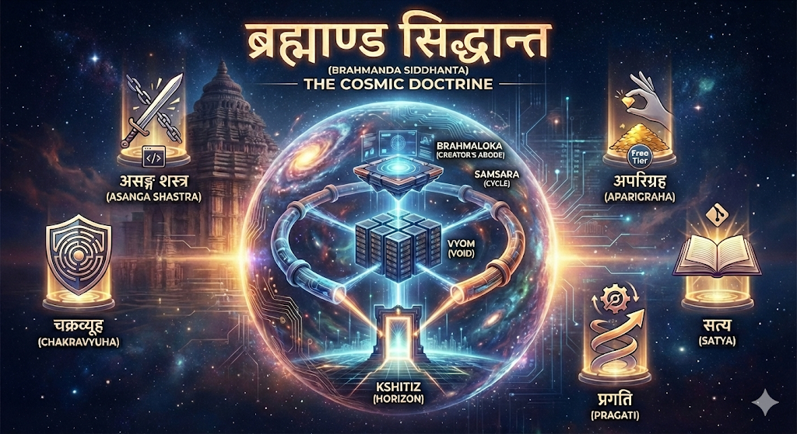

# **🕉️ Brahmanda Siddhanta (The Cosmic Doctrine)**

**"Traffic enters through the Kshitiz gateway, is processed by the Vyom cluster, orchestrated by Brahmaloka, and eternally maintained by the Samsara cycle."**

## **1. The Vision**

**Project Brahmanda** is a simulation of a production-grade, hybrid-cloud universe. It is an exercise in **Site Reliability Engineering (SRE)**, designed to validate that enterprise-grade reliability, security, and automation can be achieved with consumer-grade hardware and zero-cost cloud tiers.

This document defines the immutable *Siddhantas* (Principles) that guide every architectural decision, ensuring we do not drift into chaos (*Adharma*).

---

## **2. The Pancha-Siddhanta (The Five Guiding Principles)**

We adhere strictly to these five laws. Any deviation requires a documented justification.

### **I. Asanga Shastra (The Weapon of Detachment)**

> **"असङ्गशस्त्रेण दृढेन छित्त्वा"**
> *Asanga-shastrena dridhena chhittva*
> — *Bhagavad Gita 15.3*
> **Translation:** "Cutting the deep roots of binding existence with the strong Weapon of Detachment."

* **Principle:** Infrastructure is Transient (*Naswar*).
* **The Doctrine:** We treat servers as transient matter. We possess the capability to destroy any node, any cluster, or the entire universe, and recreate it from the void using nothing but code.
* **Application:**
* We use **Terraform** and **Ansible** to sever emotional ties with the physical layer.
* We never manually configure a server ("ClickOps"). If it isn't in code, it is an illusion (*Maya*).

### **II. Aparigraha (The Law of Frugality)**

> **"तेन त्यक्तेन भुञ्जीथा"**
> *Tena tyaktena bhunjithaa*
> — *Isha Upanishad, Verse 1*
> **Translation:** "By renouncing (excess), find your enjoyment."

* **Principle:** Zero Recurring Cost (OpEx).
* **The Doctrine:** We reject the bloat of expensive managed services. We do not accumulate monthly bills. If a free, reliable alternative exists that fits our use case, we take it.
* **Application:**
* **Strict No-Rent Policy:** We avoid recurring cloud costs whenever possible. We chose **Cloudflare R2** (Zero egress) over S3, and **Upstash** (Serverless Free Tier) over ElastiCache.
* We operate on the **"Free Tier First"** strategy. Cost efficiency is our primary metric of engineering quality.

### **III. Chakravyuha (The Labyrinth Defense)**

> **"यदा संहरते चायं कूर्मोऽङ्गानीव सर्वशः"**
> *Yada samharate chayam kurmo-'nganiva sarvashah*
> — *Bhagavad Gita 2.58*
> **Translation:** "Like a tortoise withdrawing its limbs within its shell, one withdraws their senses from objects."

* **Principle:** Deep Security & Zero Trust.
* **The Doctrine:** We assume the network is hostile. Like the *Chakravyuha* formation or the Tortoise, we present zero attack surface to the outside world. The perimeter is not a wrapper; it is a multi-layered maze woven into the fabric of the universe.
* **Application:**
* **Dark Bastions:** Management ports (SSH) are withdrawn "inside the shell." They are never exposed to the internet. We use **Nebula Mesh** and "normally-off" physical entry points.
* **Split-Horizon Architecture:** Public ingress is physically separated from private management.

### **IV. Satya (The Absolute Truth)**

> **"सत्यं परम धीमहि"**
> *Satyam param dhimahi*
> — *Srimad Bhagavatam 1.1.1*
> **Translation:** "We meditate upon the Absolute Truth (the source from which all manifest)."

* **Principle:** Single Source of Truth (GitOps).
* **The Doctrine:** The Git repository is the only reality. The state of the cluster is merely a reflection (*Pratibimba*) of the code in the repository.
* **Application:**
* **Infrastructure as Truth:** If the cluster drifts from Git, the cluster is wrong, and Git is right.
* **Credential Sovereignty:** **1Password** is the *Satya* for secrets. It is the single origin. All other tokens and keys are merely temporary projections derived from this source.

### **V. Pragati (Eternal Progression)**

> **"चरैवेति चरैवेति"**
> *Charaiveti Charaiveti*
> — *Aitareya Brahmana*
> **Translation:** "Keep moving, keep moving. (For the one who moves, their destiny moves with them.)"

* **Principle:** Progress > Perfection (The 99% Rule).
* **The Doctrine:** We do not settle for the "80/20 rule" (mediocrity), nor do we wait for "100%" (paralysis). We aim for **99% precision**—excellence that ships.
* **Application:**
* A resilient, functioning system today is superior to a theoretically perfect system tomorrow.
* We prioritize **Iterative Refinement** (*Sadhana*). We ship the MVP, then we optimize, endlessly moving forward (*Charaiveti*).

---

## **3. The Cosmology (Architecture)**

The universe is divided into four distinct planes of existence:

1. **Kshitiz (The Horizon):**

* *Role:* The Event Horizon. The secure gateway where the public cloud meets our private ground.
* *Form:* AWS Lightsail (The Lighthouse).

1. **Vyom (The Void):**

* *Role:* The Compute Core. The dense, high-gravity center where applications and data live.
* *Form:* ASUS NUC 14 Pro Plus (Kubernetes Cluster).

1. **Brahmaloka (The Creator's Abode):**

* *Role:* The Orchestration Plane. The separated control layer that manages the lifecycle of the universe, existing outside of it.
* *Form:* GitHub Runners & Dark Bastions.

1. **Samsara (The Cycle):**

* *Role:* The Force of Time. The pipelines that govern the birth (*Srishti*), maintenance (*Sthiti*), and dissolution (*Pralaya*) of the infrastructure.
* *Form:* Terraform & Ansible.

---

**"By this Siddhanta, we ensure that Brahmanda remains eternal, even as its components rise and fall."**
