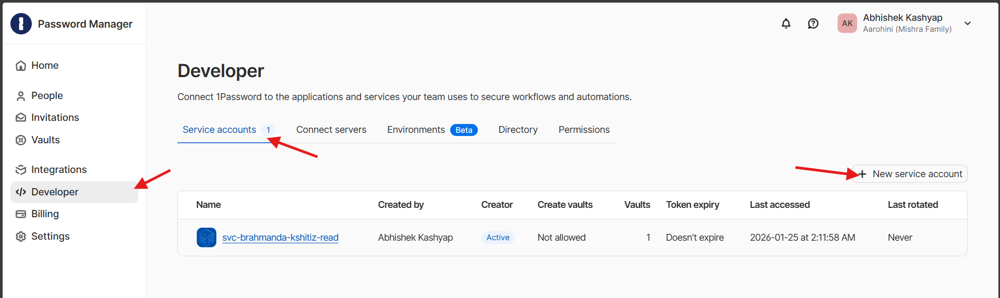
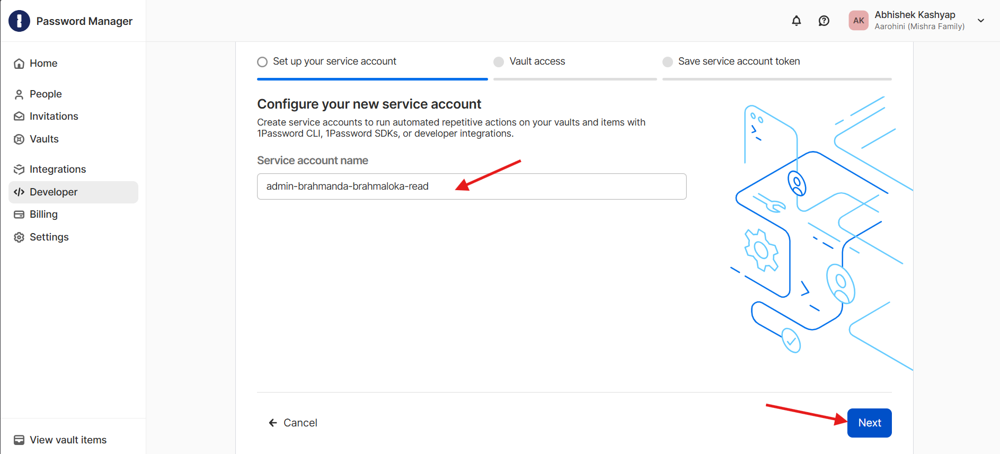
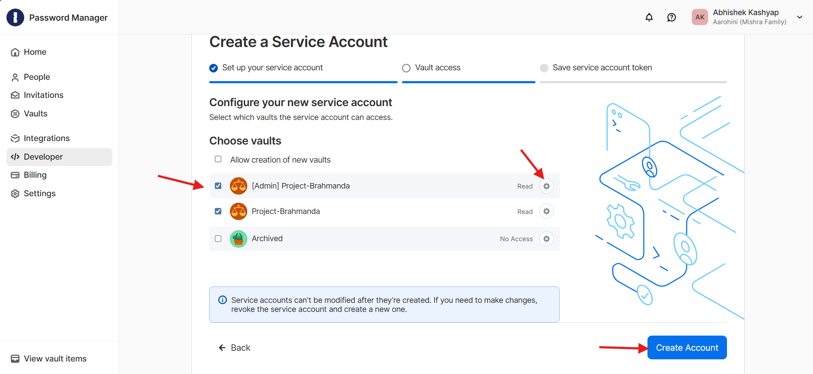
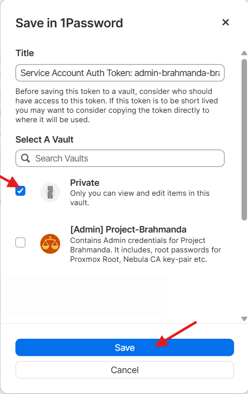
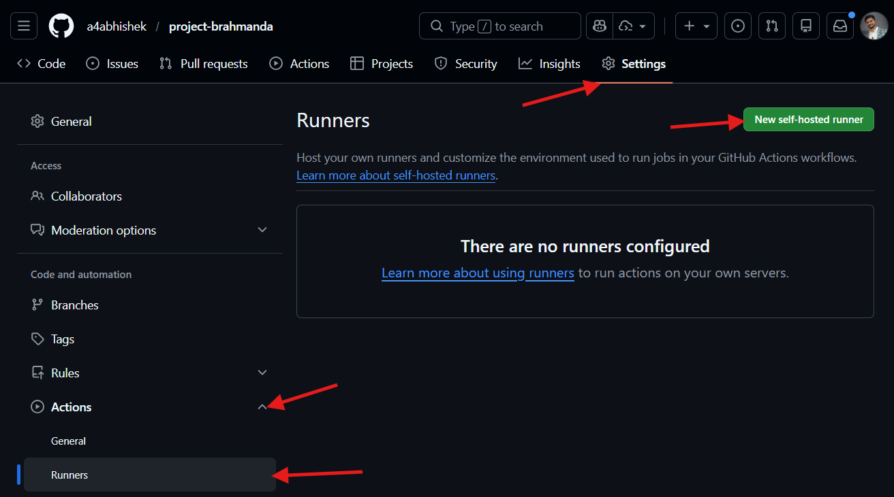
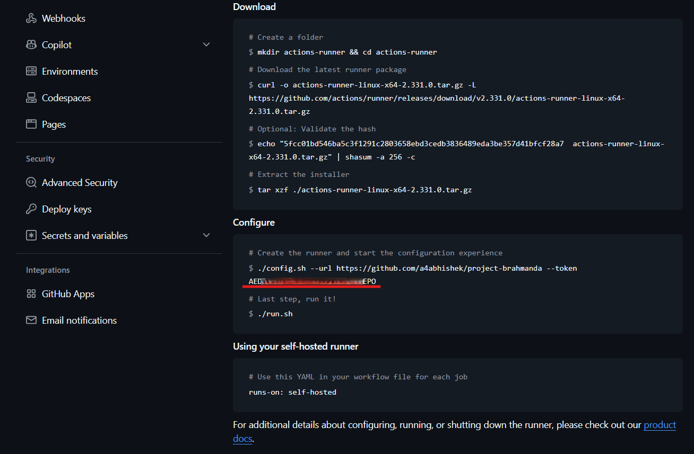

<p align="center">
भूतग्रामः स एवायं भूत्वा भूत्वा प्रलीयते ।<br>
रात्र्यागमेऽवशः पार्थ प्रभवत्यहरागमे ॥

> **Translation:** "This same multitude of beings, again and again coming into existence, dissolves helplessly at the coming of cosmic night, and manifests again at the coming of cosmic day." (Bhagavad Gita, 8.19)
</p>

# **🕉️ Samsara (The Cycle of Life)**

**Samsāra is the ceaseless rhythm of becoming and un-becoming, in whose turning even the Brahmāṇḍa itself is born, dissolved, and born anew.**

## 1. 🧘 The Philosophy

In **Project Brahmanda**, we distinguish between the Soul, the Vessel, and the World.

* ✨ **The Soul (*Atman*):** The **Source Code**. It is *Akshara* (Imperishable). It lives eternally in the Git repository, untouched by the transient failures of runtime.
* 🏺 **The Vessel (*Sharira*):** The **Container/Pod**. It is *Kshara* (Perishable). It is the transient body the code inhabits to interact with the world. It is born, it serves its purpose, and it is discarded without attachment.
* 🌍 **The Universe (*Brahmanda*):** The **Infrastructure** (Nodes, Network, Storage). The physical plane where these vessels reside.

**Samsara** is the Automation Engine that maintains the Brahmanda. When the code evolves, Samsara governs the cycle of creation, destruction and re-incarnation of the software workloads (i.e. residents of our universe).

**"The Code is the Immortal Soul. The Container is the Mortal Vessel."**

## 2. 🏛️ Vastu (The Architecture)

To establish this cycle without relying on external clouds for execution, we employ a **Self-Hosted, Identity-Aware, Locked** pipeline.

### The Components

1. **🛸 Brahmaloka (The Orchestration Plane):**
   * A dedicated, privileged Virtual Machine running on the Proxmox Hypervisor, **distinct from the Vyom cluster**.
   * It acts as the **"Abode of the Creator,"** sitting outside the failure domain of the compute cluster it manages. It possesses Layer 2 access to the network and direct API access to the Proxmox Hypervisor. It has admin credentials available to it, so that it can run the Sarga and Visarga executions.
2. **⚛️ The Atomic Unit (Sarga Execution):**
   * Deployment jobs are transactional. They acquire a **Global Lock**, execute the entire **Sarga** phase (Terraform Provisioning \+ Ansible Configuration) in one continuous motion, and then release the lock.
3. **🚀 The Trigger (Visarga Enablement):**
   * Once Samsara completes the infrastructure setup, it hands control to **ArgoCD**, which autonomously begins the **Visarga** (Population) phase, deploying software workloads.
4. **🔒 The Lease (Distributed Lock):**
   * We utilize **Upstash Redis** to implement a zero-cost distributed locking mechanism. This prevents two "entities" from trying to shape the universe simultaneously, which would lead to chaos.
5. **🧠 The Memory (Remote State):**
   * Terraform state is persisted in **Cloudflare R2** (S3-Compatible Object Storage), ensuring the memory of the universe survives the destruction of its physical form.

## 3. 📜 Diksha (The Initiation Ritual)

This document serves as the guide to establishing the **Samsara** cycle.

*Prerequisites:* You must have completed the **Sarga** (Manual Setup) guide up to the point where the Proxmox host is ready.

### Phase 1: 🔑 Admin Service Account (1Password)

We need a separate Service Account token for the nidhi framework of Brahmaloka VM. This Service will have access to both Admin and Non-Admin Project-Brahmanda vault as Brahmaloka needs credentials from both vaults.

1. **Open 1Password:** Create a new vault named **"Admin-Project-Brahmanda"**, if it doesn't exist yet.
1. **Create Service Account (1Password):**
   * Open [1Password Management Console](https://my.1password.com/developer-tools/active/service-accounts). Go to **Developer Tools** -> **Service Accounts**. Click **+ New service account**.
   <br>
   * Insert **Service account name**: `admin-brahmanda-brahmaloka-read`, and click **Next**.
   <br>
   * From the list of Vaults, select **"Project-Brahmanda"** and **"Admin-Project-Brahmanda"**. Make sure that the only **Read** permission is added.
   <br>
   * Token will be generated now. Click **Save to 1Password** to directly add it to your vault.
   <br>
   * Leave the title as it is, select **Private** from the list of vaults. It is the most secure vault as no service account has access to it.
   <br>

### **Phase 2: 🆔 Brahmaloka Identity Generation**

Before the orchestrator (Brahmaloka) can be born, it needs an identity to authenticate with the universe, and we need a secure key to access it.

#### **1. Brahmaloka Key (Operator Access)**

This is **your** personal key to SSH into the Orchestrator VM. It allows you to debug the pipeline or perform maintenance.

> **ℹ️ Note on Keys:**
>
> * **Prakriti Master Key:** Used by *Humans* & *Samsara (Runner)* to access Vyom Nodes. This key is baked into the VM templates.
> * **Brahmaloka Admin Key:** Used by *Humans* to access the Brahmaloka VM. This key is injected via Terraform during Brahmaloka creation to prevent lateral movement from compromised Vyom nodes. *(refer to [ADR-006](./vidhana/ADR-006-Brahmaloka-Orchestration-Plane.md) for more details)*.

1. **Generate the Admin Identity (Human-to-Machine)** on your local machine.

```bash
ssh-keygen -t ed25519 -C "brahmaloka-admin" -f ~/.ssh/id_brahmaloka
```

**When prompted:**

* **Enter passphrase:** Press Enter (leave empty) for automation compatibility.
* **Enter same passphrase again:** Press Enter again.

1. **Securely Store the Private Key in 1Password.** This is it's permanent location. It must reside in a dedicated vault that contains only credentials required for administrative operations (e.g. Proxmox root keys).

1. Open 1Password → Navigate to **"Admin-Project-Brahmanda"** vault.
1. Create a new **SSH Key** item:
   * **Title:** `Brahmaloka-SSH-Key`
   * **Private Key field:** Paste the contents of `~/.ssh/id_brahmaloka` (the private key)
1. Save the item.

1Password will automatically generate and display the public key and fingerprint from the private key. If you want you may remove this key from your local machine and use 1Password cline to acquire it when needed.

> ```bash
> op read "op://tojwnlkbi4j4rj5ge46dmdp7g4/Brahmaloka-SSH-Key/private key?ssh-format=openssh" > /tmp/id_brahmaloka
> chmod 600 /tmp/id_brahmaloka
> ssh -i /tmp/id_brahmaloka ubuntu@192.168.68.250 # Default brahmaloka-ip
> ```

#### 2. Acquire the GitHub Runner Token

We need a registration token to link our Brahmaloka VM to the GitHub repository.

> **💀 Critical**
>
> ❌ **DO NOT** configure a self-hosted GitHub Actions runner for a **public repository**.
> A malicious pull request could execute arbitrary and potentially dangerous code on the runner. This is especially risky because the Brahmaloka has access to **admin-level credentials and tokens**.
>
> **Mitigation:**
> The runner has been set up on a **private clone** of `project-brahmanda`, which is manually synchronized with the public repository. This prevents untrusted code from executing on the runner while still enabling controlled CI execution.

1. Navigate to your GitHub Repository -> **Settings** -> **Actions** -> **Runners**, click **New self-hosted runner**.
<br>
2. Scroll to the **Runner image** section and select **Linux**.
<br>
3. Scroll to the **Configure** section and copy the **Token** (from the `./config.sh --token XXXXX` line).
<br>

> **⚠️ Warning:** This token expires in 1 hour. Generate it immediately before proceeding to Phase 3.

1. Open 1Password → Navigate to **"Admin-Project-Brahmanda"** vault.
1. Create a new **Password** item:
   * **Title:** `GitHub-Runner-Registration-Token`
   * **Private Key field:** Paste the token copied from Step 3.
1. Save the item.

> ℹ️ **Procedural Note:** This item acts as a **Temporary Buffer**. Since the token expires in 1 hour, you must update this value in 1Password immediately before running **Phase 3** anytime you need to (re)create the runner. This maintains the "Unified Interface" for our automation scripts.

### Phase 3: 🏗️ Manifesting Brahmaloka (The Body)

We now summon the Orchestrator VM using our **Local Laptop**. This is the "Spark" that starts the engine.

1. **Configure the Vault:**
   Ensure your [samsara/ansible/group_vars/brahmanda/vault.tpl.yml](../samsara/ansible/group_vars/brahmanda/vault.tpl.yml) is configured to reference the GitHub-Runner-Registration-Token from 1Password.
2. **Seal the Vault:**
   Encrypt your configuration to prepare for transport.

   ```bash
   make nidhi-tirodhana
   ```

3. **The Incantation:**
   Run the following command to provision the VM and install the GitHub Runner agent automatically.

   ```bash
   make brahmaloka
   ```

   **Result:**
   * Terraform clones the prakriti-template.
   * It creates the `brahmaloka-runner` VM, injecting your **Brahmaloka Key** (`id_brahmaloka.pub`) into `authorized_keys`. (It overwrites the default Prakriti key for ingress security).
   * Ansible connects via SSH, installs the GitHub Actions agent, and registers it.
   * The runner comes online in GitHub as `Idle`, waiting for commands.

### Phase 4: 🔗 The Divine Connection (GitHub Trust)

For the Runner (in your home) to access the Secrets (in 1Password), we must establish a trust relationship. Add the service account token created in Phase 1 into Github.

1. **Add the service account token** created in Phase 1 as a secret in **GitHub**:
   * Go to Repo **Settings** -> **Secrets and variables** -> **Actions**.
   * Create a **New Repository Secret**.
     * **Name:** OP_SERVICE_ACCOUNT_TOKEN
     * **Value:** (Paste the Service Account Token: `Service Account Auth Token: admin-brahmanda-brahmaloka-read` from 1Password **Private** vault).
2. **Concurrency Control:**
   Ensure the workflow file (.github/workflows/samsara.yml) enforces serialization to prevent race conditions.

   ```yaml
   concurrency:
     group: production
     cancel-in-progress: false
   ```

## 4. ⚙️ The Kriya (The Workflow)

Once established, the Samsara cycle runs automatically. Here is the lifecycle of a change:

1. 💭 **Samkalpa (The Intent):** You push an Infrastructure (.tf, .yml) or Configuration change to main.
2. 📉 **Avatara (The Descent):** GitHub triggers the Samsara workflow. The brahmaloka-runner (on your NUC) picks it up.
3. 🔒 **Dharana (The Lock):** The Makefile calls Upstash Redis (SET NX) to acquire the global lease.
4. 🛠️ **Sarga Execution (Creation):**
   * **Terraform:** Reconciles the hardware state (VMs, Networking, DNS).
   <br>*Note: The runner can even update its own VM definition if required.*
   * **Ansible:** Reconciles the software state (OS Config, K3s Cluster, Nebula Mesh).
5. 📦 **Visarga Trigger (Population):**
   * With the platform ready, **ArgoCD** (running inside K3s) detects the stable cluster and begins pulling Application manifests to deploy the citizens (Software Workloads).
6. 🕊️ **Moksha (Release):** The Makefile releases the Upstash lock, freeing the pipeline for the next cycle.

## 5. 🔨 Prayaschitta (Break-Glass Protocol)

In the event of a "hung" pipeline or a zombie lock (infrastructure defined as "dead" but the lock remains held):

**1. Force Release the Lock:**

If a job crashes before releasing the lock, you must manually intervene via your local machine.

* Retrieve Upstash credentials from 1Password.
* Execute the release curl command:

```bash
  curl -X POST "$UPSTASH_URL/DEL/brahmanda_lock_<target>" \
    -H "Authorization: Bearer $UPSTASH_TOKEN"
```

**2. Resurrect the Runner:**

If brahmaloka-runner becomes unresponsive or the GitHub Token expires:

* **Access:** SSH into the VM via local LAN. If LAN is unreachable, use the **Brahmaloka-Bastion** (Raspberry Pi) via Nebula.

  ```bash
  ssh -i ~/.ssh/brahmaloka ubuntu@192.168.68.250 # Default brahmaloka-ip
  ```

* **Diagnose:** Check the pulse: `journalctl -u actions.runner.* -f`
* **Reincarnate:** If the runner is broken beyond repair, update the token in 1Password and re-run **Phase 3** (The Incantation) from your laptop to destroy and recreate it.

## 6. 🌟 Purnata (Conclusion)

By establishing **Samsara**, we have completed the engine of the universe. The infrastructure is no longer a static collection of servers but a living, breathing cycle driven by code. We have detached the Creator (You) from the Creation (Vyom), allowing the system to sustain, heal, and evolve itself.

*"Having cut down this firmly rooted tree with the strong weapon of detachment..."* — **Gita 15.3**
