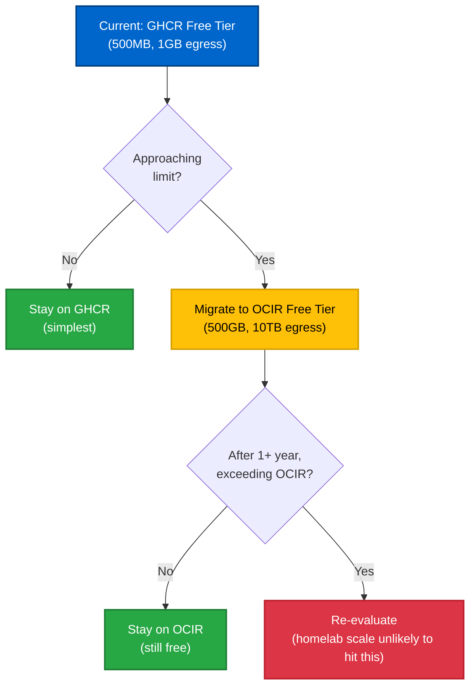
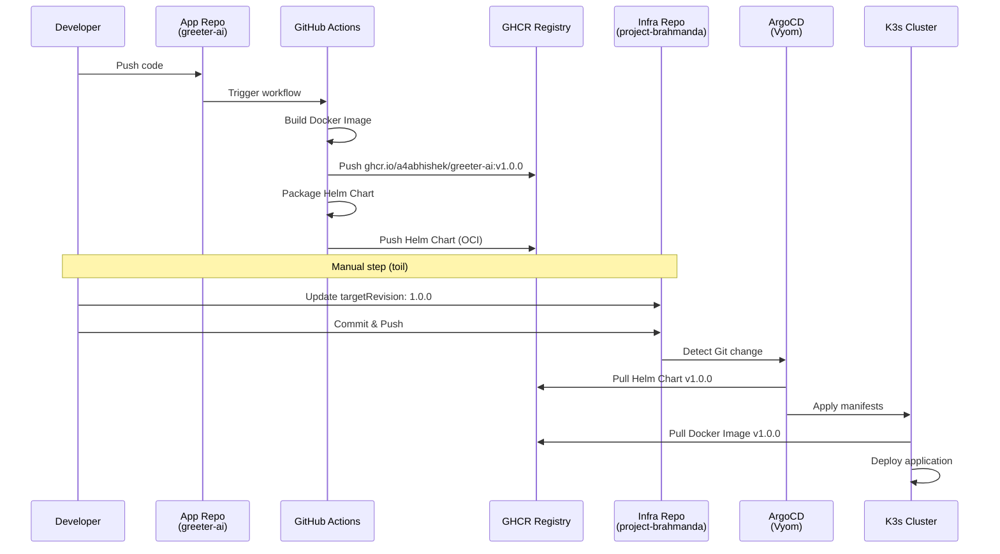
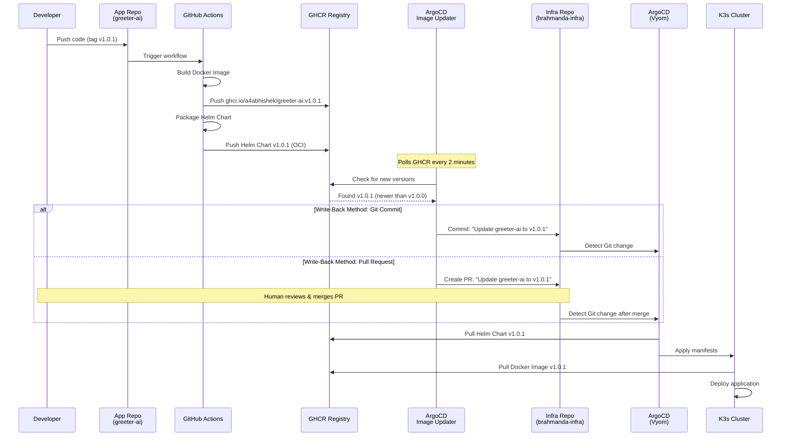
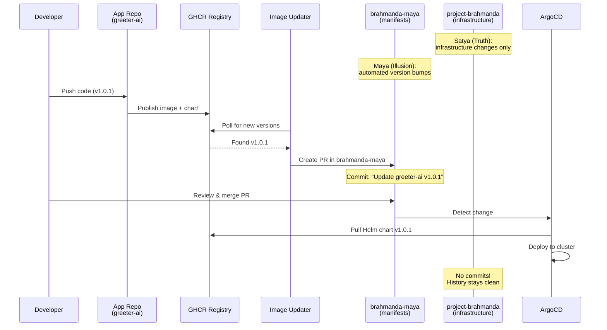

# **RFC-013: Visarga (The Architecture of Population)**

**Status:** Accepted<br>
**Date:** 2026-02-02<br>
**Decision:** See [ADR-009: Visarga Deployment Architecture](../vidhana/ADR-009-Visarga-Deployment-Architecture.md)

> **Note:** This RFC contains the problem statement, alternatives analysis, and decision rationale. For complete implementation details, see [ADR-009](../vidhana/ADR-009-Visarga-Deployment-Architecture.md).

## **1. Context**

With the *Sarga* (Creation) and *Samsara* (Automation) phases complete, we possess a functioning universe (*Vyom*), a secure gateway (*Kshitiz*), and the automation pipelines (*Brahmaloka*) to manage them. However, this universe is empty. It lacks "Citizens" (Applications).

**Visarga** (The Secondary Creation/Emanation) is the phase where we populate this infrastructure with workloads. To do this sustainably, adhering to our *Siddhanta* (Principles), we must solve the "Bridge Problem": How do independent software repositories deliver code to a locked-down, private infrastructure?

We need to define the strategy for:

1. **Ingress:** Secure entry from the chaotic public internet.
2. **Packaging:** The standardized "Vessel" for software distribution.
3. **Delivery:** The automated mechanism to sync code to cluster.

## **2. The Challenge: Bridging the Void**

We face a unique topology that defies standard cloud patterns:

* **The Edge (Kshitiz):** A public VPS (Lightsail) with a Static IP. It is the only "Public Face."
* **The Core (Vyom):** A private cluster behind a residential NAT. It has no public IP.
* **The Software:** Distributed across multiple separate GitHub repositories (e.g., greeter-ai, go-microservice).

**The Constraints:**

* **Chakravyuh (Zero Trust):** We cannot open firewall ports for webhooks.
* **Aparigraha (Frugality):** We cannot use paid load balancers or private Docker registries.
* **Asanga (Detachment):** The infrastructure must not be tightly coupled to specific application versions.

## **3. Manthana (The Options Analysis)**

In this phase, we churn the ocean of available technologies. For each decision, we weigh **Operational Overhead (Toil)** against **Performance** and **Features**.

### **A. The Edge Proxy (The Gatekeeper at Kshitiz)**

*Role: Terminates Public SSL, sanitizes traffic, and forwards it into the Nebula Tunnel.*

| Candidate | Philosophy | Pros | Cons | Verdict |
| :---- | :---- | :---- | :---- | :---- |
| **Nginx** | "The Old Guard" | Battle-hardened. Industry standard. Extremely low resource footprint. | **High Toil:** SSL (Let's Encrypt) is not native; requires managing a separate certbot process and cron jobs. Config is verbose. | **Rejected**. |
| **HAProxy** | "The Raw Power" | Extreme throughput and routing logic. | **Complexity:** High learning curve. Lacks native ACME (SSL) handling without external scripts. | **Rejected**. |
| **Traefik** | "The Dynamic Router" | Auto-discovery of Docker containers. Native Let's Encrypt. | **Mismatch:** Kshitiz is a static gateway, not a container platform. Configuring Traefik for static file backends is verbose compared to Caddy. | **Rejected**. |
| **Kong** | "The API Gateway" | Powerful plugin ecosystem (rate limiting, auth, transformations). Native ACME support. Enterprise-grade API management features. | **Over-engineered:** Built for complex API management (monetization, analytics, developer portal). High memory footprint (~200MB base). Requires PostgreSQL/Cassandra for clustering. Overkill for simple reverse proxy. | **Rejected**. |
| **Caddy** | "The Modern Minimalist" | **Automatic HTTPS:** Zero-touch SSL. Memory-safe (Go). 3-line config files. Single binary, no external dependencies. | Slightly lower raw throughput than Nginx (irrelevant for \<10k RPS). | **ACCEPTED**. |

**The Decision Weight:** We prioritized **Low Toil** over **Raw Throughput**.

* **Why:** For a solo SRE, maintaining SSL cert renewal scripts is a drain on cognitive load. Caddy's "Secure by Default" posture aligns with *Aparigraha* (Minimalism). The performance difference is negligible at our scale.

### **B. The Cluster Ingress (The Receptor in Vyom)**

*Role: Receives traffic inside the cluster and routes to Pods.*

| Candidate | Philosophy | Pros | Cons | Verdict |
| :---- | :---- | :---- | :---- | :---- |
| **NGINX Ingress** | "The Standard" | Ubiquitous. Deep customization via Annotations. | **Heavy:** Requires separate Helm installation. Higher resource footprint. | **Rejected**. |
| **Gateway API** | "The Future" | Standardized API for all ingress controllers. | **Immature:** Implementation complexity is high for a simple single-cluster setup. | **Deferred**. |
| **Cilium** | "The Kernel Native" | eBPF-based. Extremely fast. | **Complexity:** Debugging eBPF requires deep kernel knowledge. Overkill for current needs. | **Rejected**. |
| **Traefik (K3s)** | "The Bundled One" | **Native:** Pre-installed with K3s. Powerful CRDs (IngressRoute). Lightweight. | CRDs have a learning curve compared to standard Ingress objects. | **ACCEPTED**. |

**The Decision Weight:** We prioritized **Integration** over **Standardization**.

* **Why:** Using the bundled Traefik honors *Asanga* (Detachment). If we destroy the cluster, Traefik returns immediately upon rebuild without extra bootstrapping steps. NGINX would be an external dependency to manage.

### **C. Software Packaging (The Vessel)**

*Role: How do we bundle the application code for distribution?*

| Candidate | Philosophy | Pros | Cons | Verdict |
| :---- | :---- | :---- | :---- | :---- |
| **Raw Manifests** | "The Raw Truth" | Simple YAML. No tools needed. | **Rigid:** Hard to manage environment variations (Dev vs. Prod). No versioning of the *config* itself. | **Rejected**. |
| **Kustomize** | "The Patch" | Native to kubectl. Clean overlay pattern. | **Limited distribution:** Good for patching, but harder to package as a single versioned artifact for a registry. | **Alternative**. |
| **Helm** | "The Standard" | **Templating:** Powerful parameterization. **Packaging:** Can be tarballed and versioned (OCI). | **Complexity:** Go templates can be messy. | **ACCEPTED**. |

**The Decision Weight:** We prioritized **Versioning** over **Simplicity**.

* **Why:** We need a strict contract between the App Repo and the Infra Repo. Helm Charts allow us to say "Deploy version 1.2.0" deterministically.

### **D. Artifact Storage (The Library)**

*Role: Where do the Docker Images and Helm Charts live?*

| Candidate | Philosophy | Pros | Cons | Verdict |
| :---- | :---- | :---- | :---- | :---- |
| **Docker Hub** | "The Public Square" | Universal. | **Limits:** Aggressive rate limiting on free tiers. Private repos cost money. | **Rejected**. |
| **Self-Hosted (Harbor/JFrog)** | "The Sovereign" | Total control. Supports private artifacts natively. | **Circular Dependency:** If the cluster dies, the registry dies. How do you pull images to rebuild the registry? **Resource Heavy:** JFrog requires ~2GB RAM, PostgreSQL. **Maintenance Burden:** Upgrades, backups, security patches. | **Rejected**. |
| **Hybrid (Self-Hosted + R2 Backup)** | "The Restored Sovereign" | Control + Disaster recovery. Restore from Cloudflare R2/S3 backup after Pralaya. | **Complexity explosion:** Backup jobs, restore procedures, storage sync. **Violates Asanga:** Creates a stateful "Pet" requiring constant care. **Double maintenance:** Both primary registry AND backup infrastructure. | **Rejected**. |
| **Cloudflare R2** | "The Edge Cache" | S3-compatible. Zero egress fees. Can serve as OCI registry via Workers. | **Requires custom tooling:** No native OCI support (needs crane/skopeo to push). **Learning curve:** Cloudflare Workers for registry API. | **Alternative** (for DR). |
| **GHCR (GitHub)** | "The Source" | **Zero Cost** for public packages. **Private packages included** (free tier: 500MB storage, 1GB transfer/month). Integrated with Actions. Supports OCI (Images + Helm). No maintenance. | Vendor lock-in (GitHub). Rate limits on free tier (recoverable via caching). | **ACCEPTED**. |

**The Decision Weight:** We prioritized **Frugality (Aparigraha)**, **Reliability**, and **Simplicity**.

**Why Self-Hosted/Hybrid Is Rejected:**

The hybrid approach (deploy JFrog → restore from R2 backup) sounds appealing but fails the *Asanga* test:

1. **Dependency Shift, Not Elimination:** Yes, JFrog's image is available on Docker Hub (`releases-docker.jfrog.io/jfrog/artifactory-oss:latest`). But you've just traded one external dependency (GHCR) for multiple (Docker Hub + JFrog.io for bootstrap, R2 for backups). You haven't eliminated external dependencies—you've multiplied them. If Docker Hub OR JFrog.io is down during Disastor Recovery, you still can't restore.

2. **Complexity Multiplier:** You now maintain: (a) JFrog registry (upgrades, security patches), (b) PostgreSQL database (for JFrog metadata), (c) backup jobs to R2, (d) restore procedures, (e) Longhorn storage for registry data, (f) R2 bucket sync, (g) health checks for JFrog itself. Each is a failure point. GHCR maintains all of this for you.

3. **Recovery Time Explosion:** After Pralaya, you must: provision cluster (5 min) → deploy Longhorn (5 min) → restore Longhorn volumes (10-30 min depending on data size) OR sync from R2 → deploy PostgreSQL (2 min) → deploy JFrog (3 min) → wait for JFrog to be healthy (5 min) → THEN deploy apps. **Total: 30-50 minutes added to RTO.** With GHCR: `make srishti` → deploy ArgoCD → apps sync immediately. **Total: 5 minutes.**

4. **The Pet Problem:** A stateful registry is a "Pet" that needs constant care:
   * JFrog upgrades (quarterly security patches)
   * PostgreSQL upgrades and backups
   * Certificate rotation for internal TLS
   * Disk space monitoring for Longhorn volumes
   * R2 sync job maintenance
   This contradicts our *Asanga* philosophy (Weapon of Detachment).

5. **False Sense of Control:** The hybrid approach gives the illusion of "sovereignty" but you're still dependent on:
   * Docker Hub (to pull JFrog's image during recovery)
   * JFrog.io releases (for updates)
   * Longhorn (cluster storage—if cluster dies, Longhorn dies)
   * R2 (Cloudflare infrastructure)
   The difference is GHCR consolidates these dependencies into ONE provider (GitHub) that's already in your critical path for code hosting and CI/CD.

**Why GHCR Wins (Even for Private/Proprietary Repos):**

* **Private packages are FREE** (within limits: 500MB storage, 1GB egress/month per user)
* **Proprietary software fully supported:** Private GitHub repos → private GHCR packages (covered in Section D.1)
* **Single dependency point:** GitHub is already in your critical path for code hosting, CI/CD, and issue tracking. Using GHCR consolidates rather than multiplying dependencies.
* **No bootstrap complexity:** GitHub is external and highly available BEFORE your cluster exists.
* **Authentication is simple:** One GitHub Personal Access Token (PAT) handles both CI push (GitHub Actions publishing artifacts) and cluster pull (K8s fetching private images).
* **If you exceed limits:** GitHub Pro ($4/month) gives 2GB storage, 10GB egress. For context, JFrog self-hosted costs: ~2GB RAM (~$50/month equivalent in cloud), 100GB disk (~$10/month), PostgreSQL (~$30/month), your operational time (~10 hours/year at $100/hour = $1000/year amortized).
* **Zero maintenance burden:** GitHub handles security patches, TLS certificates, availability, scaling.

### **D.1. Cost Progression Strategy (Honoring Aparigraha)**

One of our core principles is **avoiding recurring costs**. The GHCR decision must be evaluated through this lens:

**Phase 1: Start with GHCR Free Tier (Current)**

* **Storage:** 500MB private packages
* **Transfer:** 1GB/month egress
* **Cost:** $0
* **When sufficient:** Early development, <5 microservices, infrequent deployments
* **Why start here:** Zero setup time, already using GitHub for code/CI, authentication is simple

**Phase 2: Evaluate Actual Usage**

Before committing to any paid service, measure real consumption:

```bash
# Monitor GHCR package storage
gh api /user/packages --jq '.[] | select(.package_type=="container") | {name, size_bytes: .size_bytes}'

# Estimate monthly pulls from cluster metrics
kubectl top pods -A | # Correlate with image pull events
```

**If limits are approaching:**

**Phase 3: Oracle Cloud Infrastructure Container Registry (OCIR) - Free Tier**

If GHCR free tier becomes insufficient, OCIR provides dramatically more generous limits **before any recurring costs**:

| Feature | GHCR Free | OCIR Always Free | GitHub Pro ($4/mo) |
|---------|-----------|------------------|-------------------|
| **Storage** | 500MB | **500GB per region** | 2GB |
| **Egress** | 1GB/month | **10TB/month** | 10GB/month |
| **Intra-region pulls** | Counts toward limit | **Free (unlimited)** | Counts toward limit |
| **Authentication** | GitHub PAT | OCI IAM token | GitHub PAT |
| **Setup complexity** | Low | Medium (IAM policies) | Low |

**Why OCIR is the next step (not GitHub Pro):**

1. **500GB storage** - 1000x more than GHCR free, 250x more than GitHub Pro
2. **10TB egress** - enough for 10,000 image pulls/month assuming 1GB images
3. **Intra-region free** - Pulling to OKE (if we expand to OCI) costs nothing
4. **Still $0 recurring cost** - honors *Aparigraha* principle
5. **External dependency maintained** - no bootstrap paradox, no self-hosting

**OCIR Setup Requirements:**

```bash
# 1. Create OCI free tier account (requires credit card for verification, but no charges)
# 2. Create container repository
oci artifacts container repository create --display-name greeter-ai

# 3. Generate auth token
oci iam auth-token create --user-id <OCID> --description "K8s pull token"

# 4. Configure K8s secret (same pattern as GHCR)
kubectl create secret docker-registry ocir-secret \
  --docker-server=<region>.ocir.io \
  --docker-username='<tenancy-namespace>/<username>' \
  --docker-password='<auth-token>'
```

**Migration Strategy (GHCR → OCIR):**

```yaml
# Update CI to push to both registries initially
- name: Push to GHCR
  run: docker push ghcr.io/${{ github.repository }}:${{ github.sha }}

- name: Mirror to OCIR
  run: |
    docker tag ghcr.io/${{ github.repository }}:${{ github.sha }} \
      iad.ocir.io/tenancy/greeter-ai:${{ github.sha }}
    docker push iad.ocir.io/tenancy/greeter-ai:${{ github.sha }}

# Gradually switch ArgoCD Applications to OCIR repositories
# Keep GHCR as fallback during transition
```

**Phase 4: Only If OCIR Free Tier Is Exhausted**

If 500GB storage + 10TB egress is insufficient (extremely unlikely for homelab scale):

1. **Re-evaluate self-hosted:** At this scale (>500GB artifacts), the operational cost might justify JFrog/Harbor
2. **Consider GitHub Pro:** If staying in GitHub ecosystem is more valuable than OCI migration
3. **Hybrid GHCR + OCIR:** Use GHCR for frequently-updated dev images, OCIR for stable prod releases

**Decision Tree:**



**Current Recommendation:**

* **Start with GHCR** (zero setup time, already in GitHub)
* **Monitor usage quarterly** (simple `gh api` calls)
* **Migrate to OCIR only if needed** (likely 1-2 years away)
* **Avoid GitHub Pro payment** until OCIR is proven insufficient (may never happen)

This strategy honors *Aparigraha* (avoiding recurring costs) while maintaining *Asanga* (external dependencies, no self-hosting complexity).

### **D.2. Private Repository Authentication**

For private GHCR packages, we need two authentication mechanisms:

**1. Kubernetes imagePullSecret (for private Docker images):**

```bash
# Create a GitHub Personal Access Token (PAT) with `read:packages` scope
# Store in 1Password: op://Project-Brahmanda/ghcr-pull-token/credential

# Create the secret (via Sealed Secrets for GitOps)
kubectl create secret docker-registry ghcr-private \
  --docker-server=ghcr.io \
  --docker-username=a4abhishek \
  --docker-password=$(op read "op://Project-Brahmanda/ghcr-pull-token/credential") \
  --docker-email=avskksyp@gmail.com \
  -n apps --dry-run=client -o yaml | kubeseal --format yaml > sealed-ghcr-secret.yaml
```

**2. ArgoCD Repository Credential (for private Helm charts):**

```yaml
# sankalpa/core/argocd-repo-creds.yaml (SealedSecret)
apiVersion: v1
kind: Secret
metadata:
  name: ghcr-helm-creds
  namespace: argocd
  labels:
    argocd.argoproj.io/secret-type: repository
stringData:
  type: helm
  name: ghcr-private
  url: ghcr.io/a4abhishek/charts
  enableOCI: "true"
  username: a4abhishek
  password: <SEALED - GitHub PAT with read:packages>
```

**3. Default imagePullSecret for Namespaces:**

```yaml
# Patch the default ServiceAccount in each namespace
apiVersion: v1
kind: ServiceAccount
metadata:
  name: default
  namespace: apps
imagePullSecrets:
  - name: ghcr-private
```

**Or use a mutating webhook (Kyverno) to inject automatically:**

```yaml
apiVersion: kyverno.io/v1
kind: ClusterPolicy
metadata:
  name: inject-ghcr-pull-secret
spec:
  rules:
    - name: add-imagepullsecret
      match:
        resources:
          kinds:
            - Pod
          namespaces:
            - apps
            - apps-*
      mutate:
        patchStrategicMerge:
          spec:
            imagePullSecrets:
              - name: ghcr-private
```

### **D.3. Cloudflare R2 as Disaster Recovery Mirror (Deferred)**

For critical images that MUST survive a GitHub outage, we can periodically mirror to R2:

```bash
# Mirror critical images to R2 (run weekly via GitHub Action or cron)
# R2 bucket: brahmanda-artifacts.r2.cloudflarestorage.com

# Using crane (from google/go-containerregistry)
crane copy ghcr.io/a4abhishek/greeter-ai:v1.0.0 \
  r2.cloudflarestorage.com/brahmanda-artifacts/greeter-ai:v1.0.0

# For Helm charts
helm pull oci://ghcr.io/a4abhishek/charts/greeter-ai --version 1.0.0
# Upload to R2 as tarball (manual restore if needed)
```

**When to use R2:**

* GitHub is down AND you need to deploy a NEW version (existing pods keep running)
* Extremely unlikely scenario—deferred until we have >10 production services

**Current Recommendation:** Trust GHCR. Use the pull-through cache (Section 7.A) for rate limit mitigation. Add R2 mirroring only if GitHub reliability becomes a proven problem.

### **E. The Delivery Mechanism (GitOps)**

*Role: Syncs the Artifacts to the Cluster.*

| Candidate | Philosophy | Pros | Cons | Verdict |
| :---- | :---- | :---- | :---- | :---- |
| **CI Push** | "The Scripted Push" | Simple. | **Insecure:** Requires giving cluster admin creds to GitHub. | **Rejected**. |
| **Flux** | "The Silent Worker" | Minimalist. "GitOps Toolkit". Headless. | **Invisible:** No native UI. Harder to visualize the "Universe" state. | **Rejected**. |
| **ArgoCD** | "The Visual Command" | **UI-First.** ApplicationSet pattern. Visualizes the hierarchy. | Heavier resource usage. | **ACCEPTED**. |

**The Decision Weight:** We prioritized **Observability** over **Lightweight**.

* **Why:** *Visarga* is about seeing the universe populated. ArgoCD provides the map.

## **4. The Architecture of Population**

We define a strict **Separation of Concerns** using the **"App-of-Apps"** pattern.

### **1. The Contract (The Interface)**

The boundary between Software (Citizen) and Infrastructure (City) is the **OCI Artifact (Helm Chart)** stored in GHCR.

* **Software Repo Responsibility:** "I promise to build a Docker Image and package a Helm Chart that works for version X."
* **Infra Repo Responsibility:** "I promise to deploy version X of your Helm Chart with *these* specific values (Ingress, Resources, Secrets)."

### **2. The Workflow (The Samsara of Software)**

#### **Manual Workflow (Initial Implementation)**



**Step 1: The Build (Software Repo)**

* Developer pushes to github.com/a4abhishek/greeter-ai.
* **GitHub Action:**
  1. Builds Docker Image → ghcr.io/a4abhishek/greeter-ai:v1.0.0
  2. Packages Helm Chart → greeter-ai-1.0.0.tgz
  3. Pushes Helm Chart to OCI Registry → ghcr.io/a4abhishek/charts/greeter-ai:1.0.0

**Step 2: The Manifestation (Infra Repo) - MANUAL TOIL**

* Developer updates [sankalpa/apps/greeter-ai.yaml](../../sankalpa/apps/greeter-ai.yaml) in brahmanda-infra:

  ```yaml
  source:
    repoURL: ghcr.io/a4abhishek/charts
    chart: greeter-ai
    targetRevision: 1.0.0  # <--- Manual update required
  ```

* Commit & Push

**Step 3: The Synchronization (Visarga)**

* **ArgoCD** (running in Vyom) detects the change in the Infra Repo
* It pulls the Helm Chart from GHCR
* It applies the Kubernetes manifests
* K3s pulls the Docker Image from GHCR
* **Result:** The application is live

---

#### **Automated Workflow (Recommended - ArgoCD Image Updater)**

**The Problem:** Manually updating `targetRevision` in the infra repo for every release is toil that violates *Aparigraha* (minimalism).

**The Solution:** [ArgoCD Image Updater](https://argocd-image-updater.readthedocs.io/) - an official ArgoCD companion tool that:

1. **Watches container registries** (GHCR, Docker Hub, Quay, etc.) for new image tags
2. **Automatically updates** Git repositories or ArgoCD Applications
3. **Supports semantic versioning** (latest patch, minor, major, or regex patterns)
4. **Creates Git commits** (direct push) or **Pull Requests** (via GitHub API)

**Implementation:** See [ADR-009: Visarga Deployment Architecture](../vidhana/ADR-009-Visarga-Deployment-Architecture.md) for complete installation, configuration, and workflow details.



**Implementation:** See [ADR-009: Visarga Deployment Architecture](../vidhana/ADR-009-Visarga-Deployment-Architecture.md) for complete installation, configuration, and annotation examples.

**Update Strategies:**

| Strategy | Pattern | Example | Use Case |
|----------|---------|---------|----------|
| `latest` | Always latest tag | N/A | Dev/staging environments (risky for prod) |
| `semver` | Semantic versioning | `semver:~1.0` (1.0.x), `semver:^1.0` (1.x.x) | Production (safe patch/minor updates) |
| `digest` | SHA256 digest tracking | `digest:main` (track main branch) | Pin to specific commit |
| `name` | Lexical/timestamp sorting | `name:v*-prod` | Custom tag patterns |

**Write-Back Methods:**

| Method | Description | Use Case |
| ------ | ----------- | -------- |
| **Git Commit** | Direct commit to main branch | Dev/staging, fully automated |
| **Pull Request** | Creates PR for human review | Production, security-conscious |

**Implementation Details:** See [ADR-009: Visarga Deployment Architecture](../vidhana/ADR-009-Visarga-Deployment-Architecture.md) for complete configuration, credentials setup, and write-back workflows.

**Alternative: Renovate Bot**

[Renovate](https://docs.renovatebot.com/) is a generic dependency updater supporting Helm charts, Docker images, and many other package types. More complex configuration than ArgoCD Image Updater but provides unified dependency updates across all tech stacks.

**Decision Matrix:**

| Tool | Complexity | Integration | Write-Back | Best For |
|------|-----------|-------------|------------|----------|
| **ArgoCD Image Updater** | Low | Native (runs in cluster) | Git or PR | Kubernetes-only environments |
| **Renovate Bot** | Medium | External (GitHub App) | PR only | Multi-tech-stack projects |
| **Manual Updates** | None | N/A | Manual | <5 apps, infrequent releases |

**Recommendation for Project Brahmanda:**

**Phase 1 (Current):** Manual updates - simple, no additional tooling
**Phase 2 (When >5 apps):** ArgoCD Image Updater with **Pull Request mode**

* Honors *Aparigraha* (minimal complexity, native integration)
* Maintains human oversight (review PRs before production deploy)
* Automates toil without sacrificing control

**Configuration:**

```bash
# Enable Image Updater for all apps in sankalpa/apps/
# Use semver strategy: ~X.Y (patch updates only)
# Write-back: Pull Request (manual merge required)
```

This gives you **automated PR generation** (your second preference) while keeping the door open for **fully automated deployment** (your first preference) when confidence in the pipeline is high.

---

#### **Repository Separation Strategy (Recommended)**

**The Problem:** If ArgoCD Image Updater commits directly to `project-brahmanda`, the commit history becomes polluted with automated version bump commits like "Update greeter-ai to v1.0.23", making it hard to track infrastructure changes.

**The Solution:** Separate application manifests into a dedicated repository.

**Repository Structure:**

```
project-brahmanda/               # Infrastructure & Core Systems
├── sankalpa/
│   ├── bootstrap.yaml          # Points to apps repo
│   ├── core/                   # Longhorn, ArgoCD, Sealed Secrets
│   ├── observability/          # Prometheus, Grafana, Loki
│   └── ingress/                # Caddy, Traefik configs
├── samsara/                    # Terraform & Ansible
└── vaastu/                     # Documentation

brahmanda-maya/                   # Application Manifestations (NEW)
└── apps/
    ├── greeter-ai.yaml
    ├── go-microservice.yaml
    └── ...
```

**Benefits:**

* ✅ **Clean infrastructure history:** `project-brahmanda` only tracks intentional infrastructure changes
**Repository Separation Strategy (Recommended)**

**The Problem:** Automated version bump commits pollute infrastructure repository history.

**The Solution:** Separate `brahmanda-maya` repository for application manifests.

**Philosophy:** Infrastructure (Satya/truth) remains in `project-brahmanda`. Application deployments (Maya/illusion) are tracked separately in `brahmanda-maya`.

**Benefits:**
* ✅ Clean infrastructure history
* ✅ Focused application version tracking
* ✅ Simpler rollbacks
* ✅ Reduced attack surface (private maya repo)
* ✅ Future scalability for collaboration

**Implementation:** See [ADR-009: Visarga Deployment Architecture](../vidhana/ADR-009-Visarga-Deployment-Architecture.md) for complete repository setup, ArgoCD bootstrap configuration, and workflow details.

**Workflow After Separation:**



**Alternative: Monorepo with Protected Paths**

If you prefer a single repository but want to isolate noisy commits:

```yaml
# project-brahmanda/.github/CODEOWNERS
# Solo developer now, but prepares for future collaboration
/samsara/ @a4abhishek
/sankalpa/core/ @a4abhishek
/sankalpa/observability/ @a4abhishek

# Apps directory allows automated commits
/sankalpa/apps/ @argocd-image-updater-bot
```

**Decision Matrix:**

| Approach | Commit History | Complexity | Future Collaboration | Recommendation |
|----------|---------------|------------|---------------------|----------------|
| **Separate Repos** | Clean infra, noisy apps | Low (standard pattern) | Excellent (easy RBAC) | ✅ **Recommended** |
| **Monorepo + CODEOWNERS** | Mixed (filterable by path) | Low | Good (GitHub teams) | OK for learning CODEOWNERS |
| **Monorepo (no separation)** | Polluted | None | Poor (noise obscures changes) | ❌ Avoid |

**Recommended Approach for Project Brahmanda:**

Create `brahmanda-maya` repository to separate concerns. This aligns with GitOps best practices and scales well as you add more applications.

**Why "Maya"?** In Advaita Vedanta, Maya represents the power to manifest the world as an illusion projected upon absolute truth (Brahman). Similarly, the cluster (running pods/services) is Maya - a temporary manifestation of the Git repository (Satya/truth). When the cluster is destroyed, the Maya vanishes, but the Git repository (Satya) remains eternal. GitOps ensures we can recreate the Maya at will.

**🔒 Private Repository Consideration:**

Keeping `brahmanda-maya` **private** provides defense-in-depth:

* **Reduced attack surface:** Attackers must guess which applications are deployed vs. knowing from public repo
* **Vulnerability disclosure control:** You control when/if to reveal application stack (critical when patching zero-days)
* **Not primary security:** Still rely on proper authentication, network policies, and hardening as primary defenses
* **Tradeoff:** Loses "portfolio showcase" effect if using homelab to demonstrate skills publicly

**ArgoCD Private Repo Access:**

```bash
# ArgoCD can access private repos via GitHub PAT or Deploy Key
kubectl create secret generic brahmanda-maya-repo \
  --from-literal=type=git \
  --from-literal=url=https://github.com/a4abhishek/brahmanda-maya \
  --from-literal=username=a4abhishek \
  --from-literal=password="$GITHUB_PAT" \
  -n argocd

# Or use GitHub App for better security (recommended)
# https://argo-cd.readthedocs.io/en/stable/user-guide/private-repositories/#github-app-credential
```

## **5. Security Architecture (Chakravyuh - The Labyrinth Defense)**

The Visarga workflow introduces new attack surfaces. We must defend the chain of custody from source to deployment.

### **A. Attack Surface Analysis**

| Surface | Threat | Mitigation |
|---------|--------|-----------|
| **GitHub Actions** | Compromised workflow injects malicious image | **1.** Pin GitHub Actions to SHA256 (not `@v1` tags).<br>**2.** Use GitHub OIDC tokens (not static PATs).<br>**3.** Enable branch protection + required reviews. |
| **GHCR Artifacts** | Tampered Helm chart or image | **1.** Sign images with Cosign/Sigstore.<br>**2.** Enable ArgoCD image verification (verify signatures before deploy).<br>**3.** Use GHCR vulnerability scanning (Trivy/Grype in CI). |
| **ArgoCD Access** | Unauthorized deployment | **1.** Enforce RBAC (applications cannot modify core infra).<br>**2.** Enable ArgoCD SSO (GitHub OAuth) for future access control.<br>**3.** Restrict `sync` permissions via AppProject CRDs. |
| **Secrets in Git** | Leaked credentials | **1.** NEVER store secrets in `values.yaml`.<br>**2.** Use `sealed-secrets` or External Secrets Operator (fetch from 1Password).<br>**3.** Enable pre-commit hooks (`detect-secrets`) to scan commits. |
| **Nebula Mesh** | Certificate compromise | **1.** Rotate Nebula certs every 90 days (automate via Ansible).<br>**2.** Use short-lived certs for Brahmaloka (24-hour validity).<br>**3.** Store Nebula CA key in 1Password (not in Git). |
| **TLS Termination** | Caddy SSL downgrade | **1.** Force minimum TLS 1.2 in Caddyfile.<br>**2.** Enable HSTS headers (`Strict-Transport-Security`).<br>**3.** Monitor cert expiry via Prometheus (`caddy_tls_cert_expiry_seconds`). |

### **B. RBAC Strategy (The Access Hierarchy)**

**ArgoCD Projects** enforce a separation of privileges:

```yaml
# sankalpa/rbac/core-project.yaml
apiVersion: argoproj.io/v1alpha1
kind: AppProject
metadata:
  name: core-system
  namespace: argocd
spec:
  description: Core infrastructure (Longhorn, Ingress, Monitoring)
  sourceRepos:
    - 'https://charts.longhorn.io'
    - 'https://prometheus-community.github.io/helm-charts'
  destinations:
    - namespace: 'longhorn-system'
      server: 'https://kubernetes.default.svc'
    - namespace: 'monitoring'
      server: 'https://kubernetes.default.svc'
  clusterResourceWhitelist:
    - group: '*'
      kind: '*'
  roles:
    - name: core-admin
      policies:
        - p, proj:core-system:core-admin, applications, sync, core-system/*, allow
      groups:
        - 'a4abhishek'  # Solo developer (full access)
        # Future: Add collaborators with limited permissions
```

**Principle:** Application deployments to `apps/*` namespaces are logically separated from `core-system` and `observability` namespaces (future-proofs for collaboration).

### **C. Network Policies (Zero Trust Within Vyom)**

Even inside the cluster, we enforce segmentation:

```yaml
# sankalpa/core/network-policies/deny-all.yaml
apiVersion: networking.k8s.io/v1
kind: NetworkPolicy
metadata:
  name: default-deny-all
  namespace: default
spec:
  podSelector: {}
  policyTypes:
    - Ingress
    - Egress
```

**Allowlist Pattern:** Each application explicitly declares its communication needs.

```yaml
# Example: Allow ArgoCD to pull from GHCR
apiVersion: networking.k8s.io/v1
kind: NetworkPolicy
metadata:
  name: argocd-egress
  namespace: argocd
spec:
  podSelector:
    matchLabels:
      app.kubernetes.io/name: argocd-repo-server
  policyTypes:
    - Egress
  egress:
    - to:
        - namespaceSelector: {}
      ports:
        - protocol: TCP
          port: 443  # GHCR HTTPS
    - to:
        - podSelector:
            matchLabels:
              app.kubernetes.io/name: argocd-server
```

### **D. Secrets Management (The Sealed Treasury)**

**Problem:** ArgoCD stores manifests in Git. If we commit `Secret` objects with base64 values, they are trivially decoded.

**Solution: Sealed Secrets (Bitnami)**

1. **Installation:**

   ```bash
   helm repo add sealed-secrets https://bitnami-labs.github.io/sealed-secrets
   helm install sealed-secrets sealed-secrets/sealed-secrets -n kube-system
   ```

2. **Workflow:**
   * Developer creates a plain `Secret` locally.
   * Encrypts it using the cluster's public key:

     ```bash
     kubeseal --format yaml < secret.yaml > sealed-secret.yaml
     ```

   * Commits `sealed-secret.yaml` to Git.
   * ArgoCD deploys the `SealedSecret`.
   * Controller decrypts it into a real `Secret` in the cluster.

3. **Key Management:** Sealed Secrets key stored in 1Password, deployed via Ansible (Nidhi framework).

**Implementation:** See [ADR-009: Visarga Deployment Architecture](../vidhana/ADR-009-Visarga-Deployment-Architecture.md) for complete Sealed Secrets setup, key management, and 1Password integration.

### **E. Image Supply Chain Security**

**Vulnerability Scanning:** Run Trivy in GitHub Actions to scan for CRITICAL/HIGH CVEs.

**Image Signing:** Use Cosign to sign container images with cryptographic signatures.

**ArgoCD Verification:** Configure ArgoCD to verify signatures before deployment.

**Implementation:** See [ADR-009: Visarga Deployment Architecture](../vidhana/ADR-009-Visarga-Deployment-Architecture.md) for complete security hardening procedures.

## **6. Operational Procedures (The Sanrakshan)**

### **A. Rollback Strategy**

Manual rollback via `argocd app rollback`, or GitOps rollback by reverting commit in Git.

### **B. Disaster Recovery**

1. Re-run Sarga + Samsara to rebuild cluster
2. Deploy ArgoCD bootstrap (sealed-secrets-key auto-deployed from 1Password via Ansible)
3. ArgoCD auto-syncs all applications from Git
4. Restore Longhorn volumes from S3/R2 snapshots

**RTO:** ~30 minutes + data restore time.

### **C. Monitoring & Alerting**

Key metrics: ArgoCD sync status, image pull failures, certificate expiry, Nebula connectivity.

### **D. Debugging Failed Deployments**

Common patterns: `ImagePullBackOff` (auth/rate limit), `CrashLoopBackOff` (app error), `Pending` (resources).

**Implementation:** See [ADR-009: Visarga Deployment Architecture](../vidhana/ADR-009-Visarga-Deployment-Architecture.md) for complete operational procedures, monitoring setup, and troubleshooting workflows.

## **7. Scaling & Performance Considerations**

### **A. Image Registry Caching**

Deploy a pull-through cache using **distribution/distribution** in the cluster, configured as proxy for GHCR.

### **B. ArgoCD Performance Tuning**

For clusters with > 50 applications: shard controller, scale repoServer horizontally.

### **C. Resource Limits**

Enforce LimitRanges per namespace to prevent noisy neighbors.

### **D. Multi-Node Readiness (Future)**

When adding second NUC: pod anti-affinity, Longhorn 2-replica storage, MetalLB L2 load balancing.

**Implementation:** See [ADR-009: Visarga Deployment Architecture](../vidhana/ADR-009-Visarga-Deployment-Architecture.md) for complete performance tuning and scaling configurations.

## **8. Edge Cases & Failure Modes**

### **A. GHCR Downtime**

**Impact:** New pods cannot start (existing pods continue running due to image caching).

**Mitigation:** Image caching (containerd), Helm chart mirroring to secondary OCI registry, cached tarball deployment.

### **B. ArgoCD Component Failure**

**Impact:** Existing apps continue running. New deployments blocked until recovery.

**HA Setup (Future):** 3 replicas of ArgoCD controller with Redis.

### **C. Nebula Mesh Partition**

Home ISP loses connectivity → External access blocked, internal services (LAN) continue, ArgoCD cannot pull from GHCR.

**Mitigation:** LAN-local development (manual image push), auto-resume sync when internet returns.

### **D. Sealed Secrets Key Loss**

**CRITICAL:** All `SealedSecret` objects become unrecoverable.

**Prevention:** Store key in 1Password (Admin-Project-Brahmanda vault) via Ansible automation.

**Implementation:** See [ADR-009: Visarga Deployment Architecture](../vidhana/ADR-009-Visarga-Deployment-Architecture.md) for complete failure mode analysis and mitigation strategies.

**HA Setup (Future):** Run 3 replicas of ArgoCD controller with Redis for HA state.

### **C. Nebula Mesh Partition (Split-Brain)**

**Scenario:** Home ISP loses connectivity. Vyom cluster cannot reach Kshitiz.

**Impact:**

* **External Access:** Public users cannot reach services (expected).
* **Internal Services:** Continue working on LAN (K8s East-West traffic unaffected).
* **ArgoCD:** Cannot pull from GHCR (requires internet).

**Mitigation:**

1. **LAN-Local Development:** Developers can SSH into Vyom via LAN IP and push images manually:

   ```bash
   docker save greeter-ai:dev | ssh vyom-node 'ctr -n k8s.io images import -'
   kubectl set image deployment/greeter-ai greeter-ai=greeter-ai:dev
   ```

2. **Resume Sync:** Once internet returns, ArgoCD automatically resumes sync.

### **D. Sealed Secrets Key Loss**

**Scenario:** The Sealed Secrets private key is lost (e.g., cluster destroyed, backup missing).

**Impact:** **Critical.** All `SealedSecret` objects become unrecoverable.

**Prevention:**

```bash
# Backup the key to Ansible Vault IMMEDIATELY after cluster creation
kubectl get secret -n kube-system sealed-secrets-key -o yaml | \
  ansible-vault encrypt --vault-id brahmanda@prompt > \
  samsara/ansible/group_vars/brahmanda/sealed-secrets-backup.yml
```

**Recovery:** If key is lost, re-create all secrets manually and re-seal them with the new cluster key.

## **9. Comparison with Alternative Patterns**

### **A. Visarga (Current) vs. Jenkins/Spinnaker**

| Aspect | Visarga (ArgoCD) | Jenkins/Spinnaker |
|--------|------------------|-------------------|
| **Complexity** | Low (declarative YAML) | High (Groovy pipelines, Java services) |
| **Cluster Coupling** | Tight (runs in cluster) | Loose (external server) |
| **Resource Usage** | ~500MB RAM | ~2GB+ RAM |
| **Rollback** | Git revert (instant) | Pipeline re-execution (slow) |
| **Observability** | Native UI | Requires plugins/dashboards |
| **Philosophy Alignment** | ✅ Asanga (transient) | ❌ Requires persistent state DB |

**Verdict:** ArgoCD aligns better with our "Infrastructure as Code" philosophy.

### **B. Sealed Secrets vs. External Secrets Operator (ESO)**

| Aspect | Sealed Secrets | ESO |
|--------|----------------|-----|
| **Dependency** | None (self-contained) | Requires external backend (1Password/Vault) |
| **Offline Support** | ✅ Yes (key stored in cluster) | ❌ No (needs API access to backend) |
| **Security** | Key compromise = all secrets lost | Backend compromise = broader risk |
| **Complexity** | Low (one controller) | Medium (backend + sync config) |
| **Rotation** | Manual (re-seal secrets) | Automatic (backend handles rotation) |

**Current Choice:** Sealed Secrets (simpler, no external dependency).
**Future Migration:** ESO when we have HA 1Password Connect server.

## **10. Future Enhancements (Deferred Complexity)**

The following are **deliberately excluded** from the current design to honor the 99% quality principle:

1. **Multi-Cluster ArgoCD:** When we add a second physical cluster (e.g., AWS EKS for public services), we'll deploy ArgoCD Hub for centralized management.

2. **Progressive Delivery (Flagger):** Canary deployments with automated rollback based on metrics. Deferred until we have > 5 production services.

3. **Policy Enforcement (OPA Gatekeeper):** Deny deployments that don't meet security policies (e.g., `runAsRoot: false`). Deferred until we onboard external contributors.

4. **Service Mesh (Istio/Linkerd):** mTLS for all East-West traffic. Deferred due to complexity and resource overhead on single-node cluster.

5. **Image Vulnerability Gates:** Block deployments if Trivy scan finds CRITICAL CVEs. Deferred to avoid blocking legitimate deploys during security backlog.

## **11. Conclusion**

By selecting **Caddy**, **GHCR**, **Helm**, and **ArgoCD**, we have built a chain of custody that is:

1. **Secure:** No inbound ports, no cluster creds in CI, signed artifacts, RBAC, network policies, sealed secrets.
2. **Decoupled:** Apps don't know about the cluster; the Cluster doesn't know about App build processes. They meet only at the Helm Chart.
3. **Visual:** ArgoCD makes the state of the universe observable.
4. **Resilient:** Rollback strategies, disaster recovery procedures, and failure mode mitigations.
5. **Scalable:** Image caching, performance tuning, multi-node readiness patterns.
6. **Operational:** Monitoring, alerting, debugging workflows, and edge case handling.

This completes the comprehensive design of *Visarga*—the manifestation and population of the Brahmanda universe.
