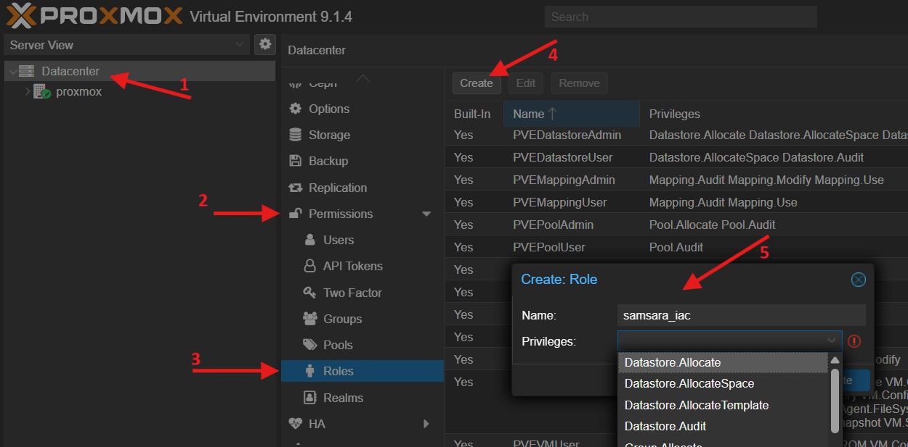
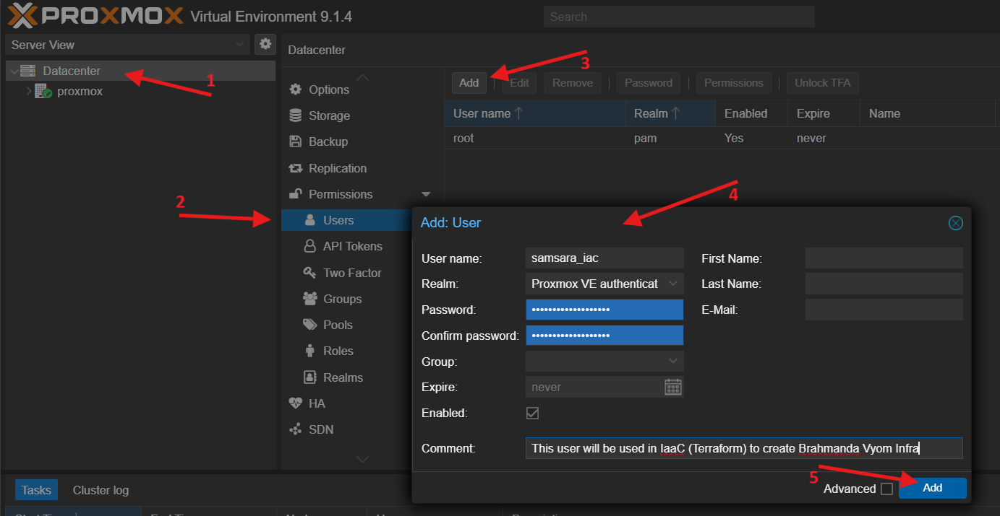
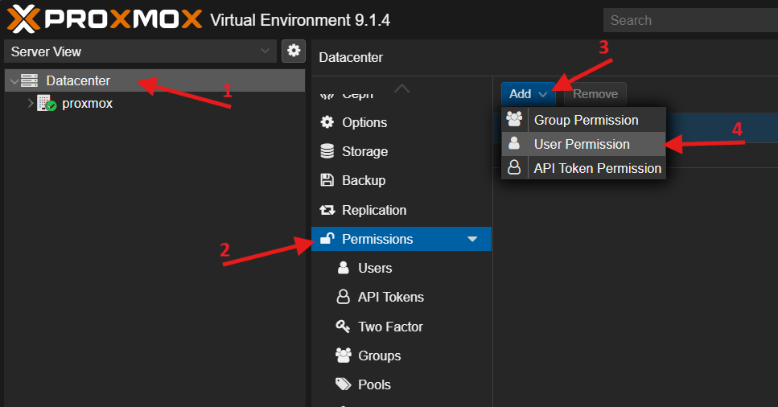
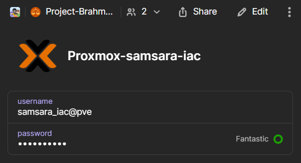

# **ADR-003: Hybrid Secret Management & Dynamic Discovery Strategy**

**Date:** 2026-01-12 (Amended from 2025-12-31)<br>
**Status:** Accepted

**Enhancements:**

- [manthana/RFC-003-Secret-Management.md](../manthana/RFC-003-Secret-Management.md)
- [manthana/RFC-006-Automated-Vault-Generation.md](../manthana/RFC-006-Automated-Vault-Generation.md)
- [manthana/RFC-007-Terraform-Secret-Management](../manthana/RFC-007-Terraform-Secret-Management.md)
- [manthana/RFC-008-Dynamic-Ansible-Inventory](../manthana/RFC-008-Dynamic-Ansible-Inventory.md)

## **Context**

Project Brahmanda faces two critical operational challenges regarding secrets and state:

1. **The Connectivity Paradox (Secrets):** We require 1Password as our Single Source of Truth (SSOT). However, relying solely on an online-only secret manager creates a deadlock: we cannot fetch keys to fix the network if the network itself is down (e.g., Lighthouse failure).
2. **The Data Island Problem (State):** Terraform knows the state of the universe (IP addresses, metadata), but Ansible, the responsible for configuring it, is blind to this state. Manual synchronization (copy-pasting IPs) is error-prone and violates the "Samsara" principle of automated lifecycles.

We need a strategy that unifies **Secret Management**, **Infrastructure Provisioning**, and **Configuration** into a single, automated, and resilient workflow.

## **Decision**

We will adopt a **Dual-Mode Hybrid Secret Management** model integrated with **Artifact-Driven Dynamic Discovery**.

### **A. Provisioning Mode (Terraform \+ 1Password Provider)**

For infrastructure provisioning (AWS, Cloudflare, Proxmox), Terraform will use the **official 1Password Provider**. Secrets will be fetched declaratively during the plan and apply phases directly from the 1Password API. This eliminates the need for manual export of environment variables and prevents secret leakage in shell histories.

### **B. Configuration Mode (Ansible \+ Scoped Vaults)**

For node configuration (Nebula, K3s, Hardening), we will use **Ansible Vault** encrypted at rest in Git. These vaults are generated from templates that reference 1Password (the **Nidhi Framework**). This preserves the **"Asanga Shastra"** (Detachment) principle, allowing for offline disaster recovery.

### **C. Discovery Mode (The Manifest Adapter)**

To bridge the gap between Provisioning and Configuration, we adopt the **Manifest Adapter** pattern. Terraform is responsible for outputting a clean, sanitized `manifest.json` artifact. Ansible consumes this artifact, decoupling it from the complex internal Terraform state.

### **D. Authentication Mode (The Temporary Scepter)**

To securely authenticate Ansible against the discovered hosts without storing private keys on disk, we will use the **Makefile** as an orchestrator to manage ephemeral key files.

## **Implementation**

The implementation follows the **Samsara Lifecycle**, moving from authoritative secrets to provisioning, discovery, and finally configuration.

### **Layer 1: Secret Distribution Strategy**

| Layer | Tool | Source | Use Case |
| :---- | :---- | :---- | :---- |
| **Authoritative** | 1Password | Project-Brahmanda Vault | SSOT for all keys, tokens, and passwords. |
| **Provisioning** | Terraform | onepassword Provider | Dynamic injection into AWS, Cloudflare, and Proxmox providers. |
| **Discovery** | Python Script | `manifest.json` | Mapping of Manifest Artifact to Ansible Groups. |
| **Configuration** | Ansible | Scoped `vault.yml` | Encrypted-in-Git secrets for mesh and cluster setup. |
| **CI/CD** | GitHub Actions | `OP_SERVICE_ACCOUNT_TOKEN` | The single bootstrap secret required to unlock the universe. |

#### Secrets Flow

```
       1Password (Project-Brahmanda Vault)
                 │
        ┌────────┴────────┐
        ▼                 ▼
   Terraform          Ansible Vault
 (Direct API)       (Template Generation)
        │                 │
        ▼                 ▼
  Provisioning       Configuration
(Cloud/VMs/IPs) ◄─── (Dynamic Discovery)
```

### **Layer 2: Provisioning (Terraform Integration)**

Terraform uses the `1Password/onepassword` provider to fetch credentials declaratively and in-memory at runtime. This prevents secrets from ever touching disk or shell history on the developer's machine.

Terraform configurations **MUST** use the `onepassword_item` data source for provider authentication.

```hcl
# Example: samsara/terraform/kshitiz/main.tf

# 1. Define the data source to fetch the 1Password item.
data "onepassword_item" "aws_credentials" {
  vault = "Project-Brahmanda"
  title = "AWS-samsara-iac"
}

# 2. Configure the provider using the fetched secret.
provider "aws" {
  access_key = data.onepassword_item.aws_credentials.username
  secret_key = data.onepassword_item.aws_credentials.password
}
```

### **Layer 2.1: Proxmox IaC User and Role**

To adhere to the principle of least privilege, Terraform does not use the `root` user. A dedicated user and role with the minimum required permissions are created in Proxmox. This is a one-time manual setup.

**Step 1: Create the `samsara_iac` Role**

1. Navigate to `Datacenter -> Permissions -> Roles` in the Proxmox Web UI.
2. Click `Create` and set the **Role Name** to `samsara_iac`.
3. Grant the role the following privileges:
    - `VM.Allocate`
    - `VM.Audit`
    - `VM.Clone`
    - `VM.Config.CDROM`
    - `VM.Config.CPU`
    - `VM.Config.Cloudinit`
    - `VM.Config.Disk`
    - `VM.Config.HWType`
    - `VM.Config.Memory`
    - `VM.Config.Network`
    - `VM.Config.Options`
    - `VM.Migrate`
    - `VM.PowerMgmt`
    - `Pool.Allocate`
    - `Sys.Audit`
    - `Sys.Console`
    - `Sys.Modify`
    - `Datastore.AllocateSpace`
    - `Datastore.Audit`
4. Click `Create`.



**Step 2: Create the `samsara_iac` User**

1. Navigate to `Datacenter -> Permissions -> Users`.
2. Click `Add`.
3. Set the **User name** to `samsara_iac`.
4. Ensure the **Realm** is `Proxmox VE authentication server`.
5. Set a strong, unique password.
6. Click `Add`.



**Step 3: Grant Permissions to the User**

1. Navigate to `Datacenter -> Permissions`.
2. Click `Add` and select `User Permission`.
3. Set the **Path** to `/` (the root of the datacenter).
4. Select the **User** `samsara_iac@pve`.
5. Select the **Role** `samsara_iac`.
6. Click `Add`.



**Step 4: Store the Credentials in 1Password**

1. Create a new **Login** item in the `Project-Brahmanda` vault.
2. Set the **Title** to `Proxmox-samsara-iac`.
3. Set the **Username** to `samsara_iac@pve`. **Note:** The `@pve` realm suffix is critical for API authentication.
4. Save the password created in Step 2.
5. This is the item that Terraform will reference.



### **Layer 3: Discovery (The Manifest Adapter)**

To solve the "Data Island" problem,Ansible will no longer rely on a static `hosts.yml`. Instead, the inventory is manifested via a stable contract.

- **The Artifact:** Terraform generates `samsara/inventory/manifest.json` using the `local_file` resource. This file contains *only* public IPs, private IPs, and roles.
- **The Consumer:** `scripts/inventory_discovery.py` reads this JSON file.
- **Logic:**
  1. Read manifest.json.
  2. Map entries to Ansible groups (e.g., role: lighthouse → kshitiz).
  3. Output JSON inventory for Ansible.

Ansible uses an executable script as its inventory source:

- **Source File:** `samsara/ansible/inventory/dynamic_inventory.py`
- **Configuration (`ansible.cfg`):**

    ```ini
    [defaults]
    inventory = ./inventory/dynamic_inventory.py
    ```

### **Layer 4: Authentication (The Ephemeral Key)**

We adhere to a strict **"No Long-Lived Private Keys on Disk"** policy. The `Makefile` orchestrates a secure handover:

1. **Materialize:** Before running Ansible, the `make` target reads the appropriate SSH private key from 1Password and writes it to a unique, temporary file (e.g., `/tmp/kshitiz_ssh_key_12345`).
2. **Secure:** It immediately runs `chmod 600` on the temporary file.
3. **Inject:** The `make` target calls `ansible-playbook`, passing the path to the temporary key file directly via the `--private-key` command-line flag.

    ```makefile
    # Example from Makefile 'kshitiz' target
    ansible-playbook playbooks/01-bootstrap-kshitiz.yml \
        --private-key="/tmp/kshitiz_ssh_key_12345" \
        ...
    ```

4. **Dissolve:** A `trap` in the `Makefile` guarantees the temporary key file is **deleted immediately** after the playbook execution completes, regardless of success or failure.

This pattern completely decouples Ansible's inventory from the authentication mechanism, as the key is provided imperatively by the orchestrator.

### **Layer 5: Configuration (The Nidhi Framework)**

For secrets that need to be placed *on the node* (e.g., Nebula certificates), we use the Nidhi (Treasure) framework. This provides offline resilience for Ansible.

1. **Template (`vault.tpl.yml`):** A template file defines the required secrets with `op://` references. This file is committed to Git and serves as documentation for the vault's structure.

    ```yaml
    # From: samsara/ansible/group_vars/kshitiz/vault.tpl.yml
    nebula_ca_crt: |
      op://Project-Brahmanda/Nebula-CA-Root-Certificate/ca.crt
    ```

2. **Generation (`make nidhi-tirodhana`):** The `make` target uses `op inject` to read the template, fetch secrets from 1Password, and generate a corresponding encrypted `vault.yml` file. This encrypted file is also committed to Git.
3. **Usage:** Ansible automatically decrypts and loads variables from `vault.yml` at runtime, using them in tasks (e.g., copying the `nebula_ca_crt` content to the remote server).

## **Workflow Visualization**

### **The "Srishti" Workflow (Local & CI/CD)**

```bash
# 1. Environment Setup (Inject 1Password Service Token)
export OP_SERVICE_ACCOUNT_TOKEN=$(op read "op://Project-Brahmanda/Service-Account/token")

# 2. Invoke Creation
make srishti
```

**Under the Hood of `make srishti`:**

1. **Terraform Apply:**
    - Auth: Uses `onepassword` provider via `OP_SERVICE_ACCOUNT_TOKEN`.
    - Action: Provisions infrastructure.
    - Artifact: Writes `manifest.json` to local disk. This would be added to artifact in the Pipeline.
2. **Key Materialization (in `make kshitiz`):**
    - Action: `op read ... > /tmp/kshitiz_ssh_key_$$`.
    - Security: `chmod 600` on the temp file.
3. **Ansible Execution:**
    - Discovery: Calls `inventory_discovery.py` which reads the R2 state.
    - Auth: Receives path to temp key via `--private-key` flag from `make`.
    - Config: Decrypts Git-vaults for Nebula/K3s setup.
4. **Cleanup:**
    - Action: A `trap` in the `make` target ensures `rm /tmp/kshitiz_ssh_key_$$` is always executed.

## **Consequences**

### **Positive**

- ✅ **Explicit Contract:** The `manifest.json` creates a clean interface between Terraform and Ansible.
- ✅ **Least Privilege:** The inventory script no longer needs access to the sensitive `terraform.tfstate`.
- ✅ **Zero Manual Sync:** IPs and metadata flow automatically from Terraform to Ansible.
- ✅ **Declarative Dependency:** Terraform explicitly declares its secret requirements.
- ✅ **Security:** Private keys exist on disk only for the duration of the command.
- ✅ **Idempotency:** The entire chain can be re-run safely; discovery always reflects the current reality.

### **Negative**

- ⚠️ **Artifact Management:** `manifest.json` is a generated file that should generally be gitignored to prevent stale data commits, requiring a fresh terraform apply or refresh to generate it on new machines.
- ⚠️ **Sync Requirement:** Developers must run `make nidhi-tirodhana` if secret templates (`vault.tpl.yml`) change.

## **Conclusion**

By combining the **1Password Terraform Provider** (Provisioning) with the **Manifest Adapter** (Discovery) and the **Nidhi Framework** (Configuration), we have closed the automation loop. The universe is defined by its manifest, secured by its authoritative vault, and instantiated through a fully automated pipeline.
