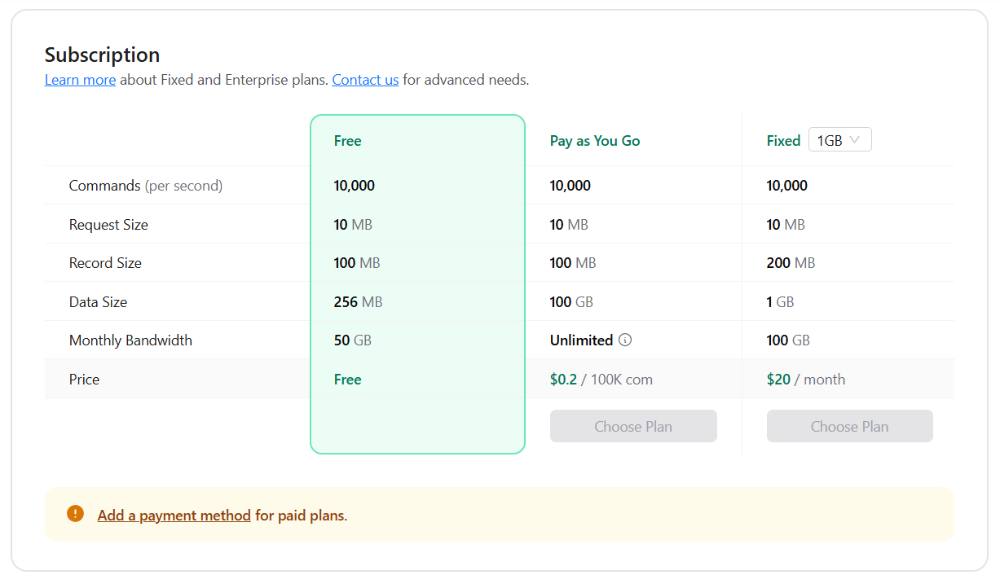
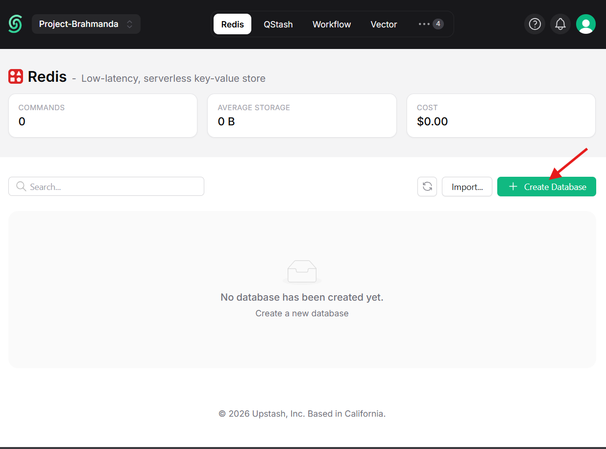
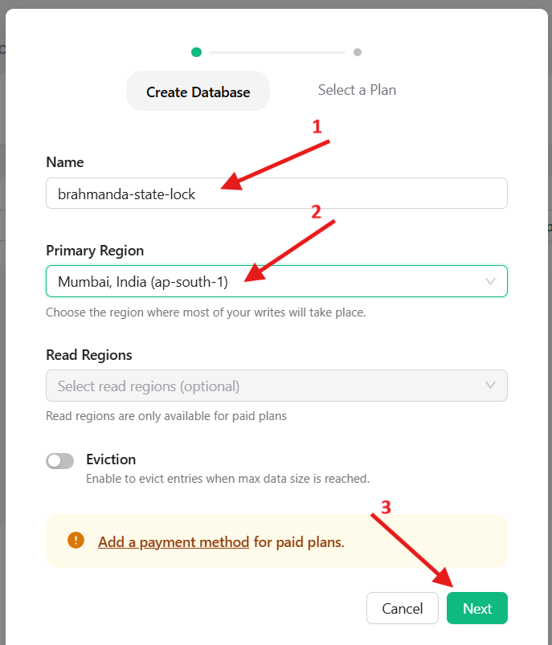
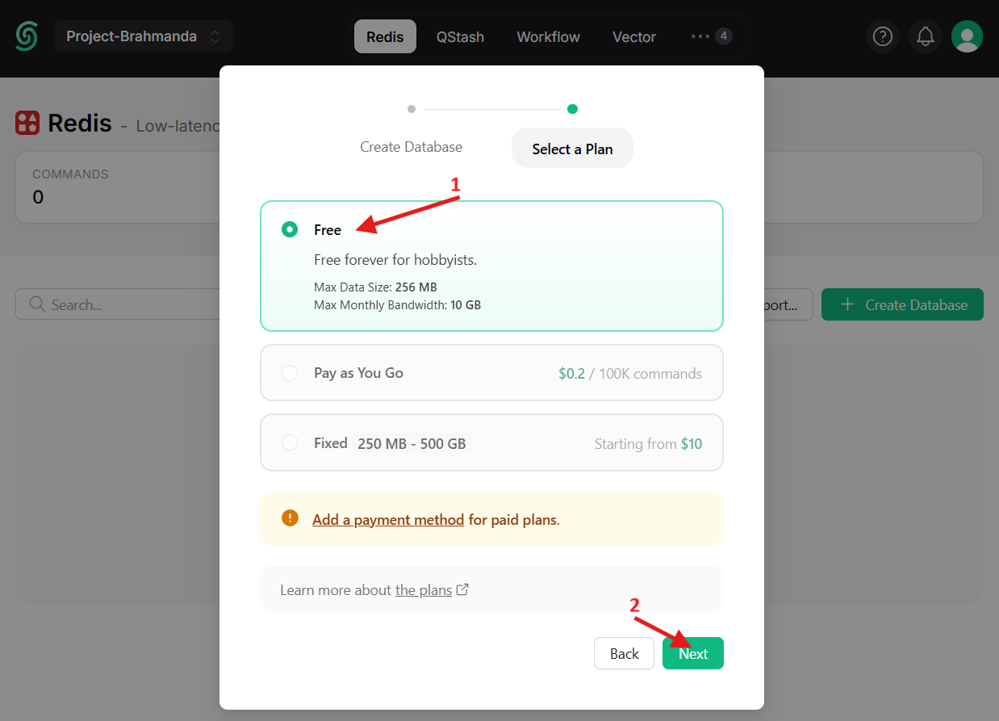
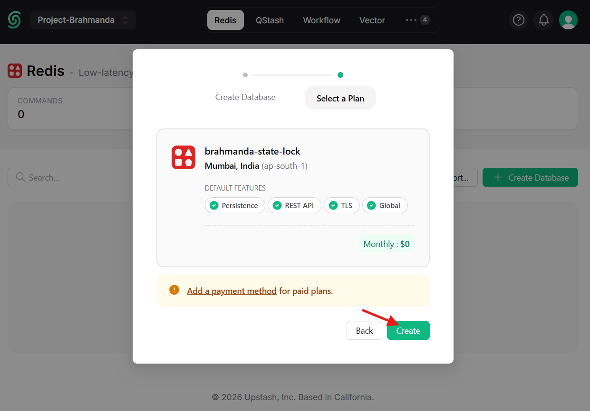
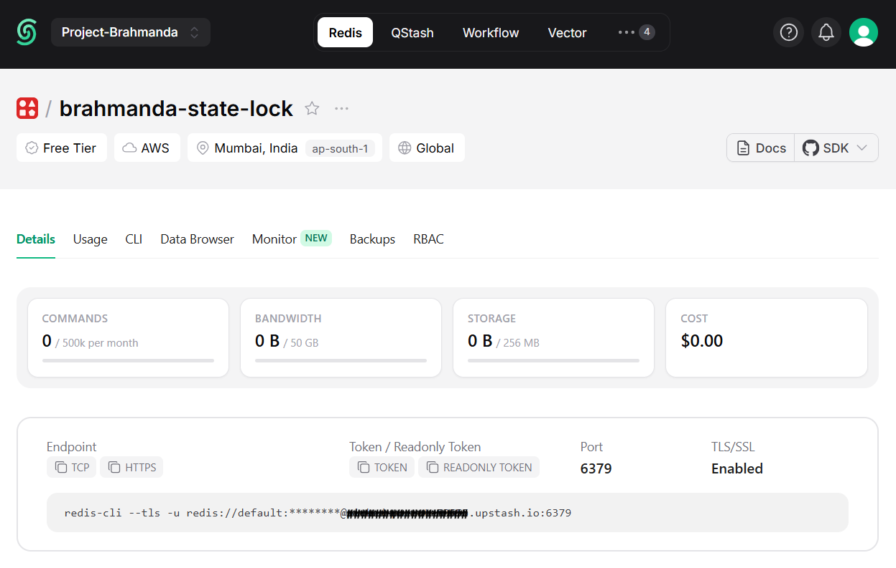
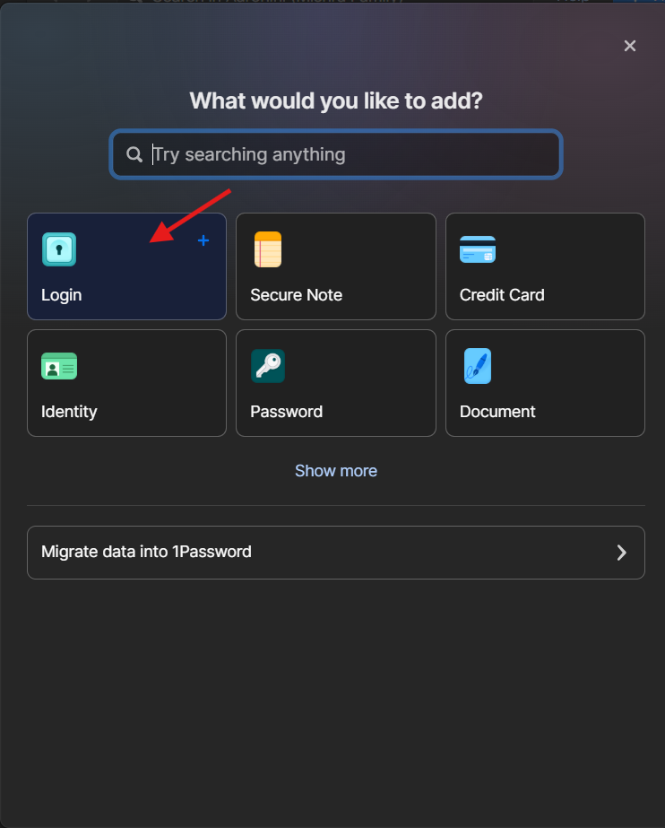
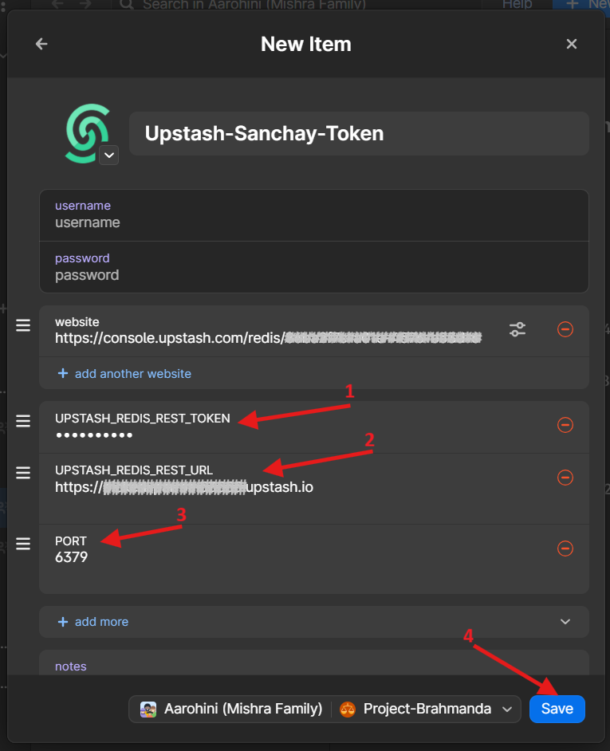

# **ADR-007: Terraform State & Distributed Locking Strategy**

**Date:** 2026-01-24<br>
**Status:** Accepted<br>
**Enhancements:** [ADR-003-secret-management.md](./ADR-003-secret-management.md)<br>
**Related RFC:** [RFC-012-Terraform-State-And-Locking-Strategy.md](../manthana/RFC-012-Terraform-State-And-Locking-Strategy.md)

## **1. Context**

To enable the Samsara automation cycle (CI/CD), Terraform state must be moved from local disk to a remote backend. Additionally, to prevent concurrent infrastructure changes (race conditions) and ensure the atomicity of the deployment pipeline (which includes both Terraform and Ansible), a distributed locking mechanism is required.

Project Brahmanda operates under strict financial constraints (*Aparigraha*), aiming for zero recurring costs where possible. Standard solutions like AWS DynamoDB or Terraform Cloud incur costs or vendor lock-in that we wish to avoid.

## **2. Decision**

We will implement a **Cost-Optimized Hybrid Strategy**:

1. **State Storage:** **Cloudflare R2** (S3-Compatible)
   * **Rationale:** Free Tier (10GB/month), Zero Egress fees, existing ecosystem usage.
2. **State Locking:** **"The Makefile Lease" (Upstash Redis)**
   * **Rationale:** Free Tier (daily resetting quota), simple HTTP API (curl), decoupling from AWS.
   * **Scope:** The lock covers the **Entire Atomic Unit** of work (Terraform Provisioning + Ansible Configuration).
   * **Enforcement:** We implement **Defense in Depth**. The Makefile acquires the lock, but Terraform and Ansible internally verify they hold the lock before making changes.
   <br>

## **3. Implementation**

### **A. Terraform Backend Configuration (R2)**

Terraform uses the S3 backend protocol to talk to R2. Configuration requires specific compatibility flags to bypass AWS-specific checks.

```hcl
# samsara/terraform/kshitiz/versions.tf (and vyom/versions.tf)
terraform {
  backend "s3" {
    bucket                      = "brahmanda-state"
    key                         = "kshitiz/terraform.tfstate" # Unique per layer
    region                      = "auto"
    skip_credentials_validation = true
    skip_region_validation      = true
    skip_requesting_account_id  = true
    skip_metadata_api_check     = true
    use_path_style              = true
    # Endpoint is passed via -backend-config="endpoint=..." in Makefile
  }
}
```

### **B. Distributed Locking (The Upstash Lease)**

Locking is orchestrated by the Makefile using curl to interact with the Upstash Redis REST API.

#### **1. Prerequisite: Upstash Token Generation**

1. Log in to the [Upstash Console](https://console.upstash.com/), and click **Create Database**.
    <br>
2. Fill-in details:
    * **Name:** `brahmanda-state-lock`
    * **Primary Region:** `Mumbai, India (ap-south-1)`
    * **Read Regions** (Optional): `Singapore (ap-southeast-1)`
    * Click **Next**
    <br>
3. Select a Plan
    * Leave the **Free** plan selected.
    * Click **Next**
    <br>
4. Verify and create
    * Verify the presented details are correct.
    * Click **Create**.
    <br>
5. Save the credentials in 1Password
    * Upstash will present the database homepage, keep it open.
    <br>
    * In 1Password, click **New Item**, and select **Login**.
    <br>
    * **Title:** `Upstash-Sanchay-Token`.
    * Leave **username** and **password** blank.
    * **website**(Optional): You may add the Upstash Database Homepage.
    * Add a **Password** field named `UPSTASH_REDIS_REST_TOKEN` and save the **TOKEN** you copy from upstash page.
    * Add a **Text** field named `UPSTASH_REDIS_REST_URL` and save the **URL** you copy from upstash page.
    * Add a **Text** field named `PORT` and add the **Port** (usually `6379`) from upstash page.
    * Click **Save**.
    <br>

#### **2. Prerequisite: Secret Storage (1Password)**

Store these credentials in the Project-Brahmanda vault.

* **Item Name:** Upstash Redis - Brahmanda
* **Fields:**
  * url: (The REST URL, e.g., <https://funny-monkey-32145.upstash.io>)
  * token: (The long alphanumeric bearer token)

#### **3. Identity Generation (BRAHMANDA_JOB_ID)**

To identify *who* holds the lock, we generate a unique Session ID. This is standardized across all tools.

* **GitHub Actions:** Maps GITHUB_JOB (Unique Run ID).
* **Local Development:** `Generates local_<timestamp>`.

**Makefile Logic:**

```bash
# If running in CI, use the GitHub Job ID. Otherwise, generate a timestamp.
BRAHMANDA_JOB_ID ?= $(if $(GITHUB_JOB),$(GITHUB_JOB),local_$(shell date +%s))
export BRAHMANDA_JOB_ID
```

#### **4. The Locking Workflow (Makefile)**

The lock uses the Redis SET command with NX (Not Exists) and PX (Expire Time) options.

**Step 1: Acquire Lock (SET NX PX)**

* **Logic:** Try to set a key. If it exists, fail. If not, set it with a **15-minute TTL** (to cover Vyom provisioning).
* **Command:**

  ```bash
  curl -X POST "$UPSTASH_URL/SET/brahmanda_lock_vyom/$BRAHMANDA_JOB_ID/NX/PX/900000" \
  -H "Authorization: Bearer $UPSTASH_TOKEN"
  ```

* **Response Handling:**
  * "OK" ➡️ **Proceed.** Lock acquired.
  * `null` (or `nil`) ➡️ **Abort.** Another job holds the lock.

**Step 2: Execute (With Verification)**

* Run `terraform apply -var="brahmanda_job_id=$BRAHMANDA_JOB_ID".`
* Run `ansible-playbook -e "brahmanda_job_id=$BRAHMANDA_JOB_ID".`

**Step 3: Release Lock (DEL)**

* **Logic:** Delete the key to free the lock for the next run.
* **Command:**

  ```bash
  # Optional Safety: Check value matches $BRAHMANDA_JOB_ID before deleting (Lua script)
  # Basic Implementation:
  curl -X POST "$UPSTASH_URL/DEL/brahmanda_lock_vyom" \
       -H "Authorization: Bearer $UPSTASH_TOKEN"
  ```

* **Safety:** This is placed inside a trap block to guarantee execution.

### **C. Defense in Depth (Native Enforcement)**

To prevent corruption from manual runs bypassing the Makefile, the tools themselves verify the lock.

#### **1. Terraform Enforcement**

Using data "http" to peek at the lock before applying changes.

```hcl
variable "brahmanda_job_id" {
  description = "Injected by Makefile to verify lock ownership"
  type        = string
}

# Fetch Upstash secrets via 1Password Provider (ADR-003)
data "onepassword_item" "upstash" {
  vault = "Project-Brahmanda"
  title = "Upstash Redis - Brahmanda"
}

data "http" "lock_check" {
  url = "${data.onepassword_item.upstash.url}/GET/brahmanda_lock_vyom"
  request_headers = {
    Authorization = "Bearer ${data.onepassword_item.upstash.token}"
  }
}

# Lifecycle Precondition (Terraform 1.2+)
resource "null_resource" "lock_guard" {
  triggers = {
    always_run = timestamp()
  }

  lifecycle {
    precondition {
      # Verify the lock value in Redis matches the Job ID passed to Terraform
      condition     = jsondecode(data.http.lock_check.response_body).result == var.brahmanda_job_id
      error_message = "❌ FATAL: Deployment Lock mismatch! The lock in Redis does not match 'var.brahmanda_job_id'. You must run this via 'make srishti'."
    }
  }
}
```

#### **2. Ansible Enforcement**

Using a pre_task to assert lock ownership.

```yaml
  pre_tasks:
    - name: 🛡️ Verify Distributed Lock Ownership
      uri:
        url: "{{ upstash_url }}/GET/brahmanda_lock_vyom"
        headers:
          Authorization: "Bearer {{ upstash_token }}"
        return_content: true
      register: lock_status
      failed_when: lock_status.json.result != brahmanda_job_id
      delegate_to: localhost
```

## **4. Consequences**

### **Positive**

* ✅ **Zero Cost:** R2 and Upstash Free Tiers cover 100% of usage.
* ✅ **Broad Protection:** Locks the entire pipeline, preventing Ansible conflicts that Terraform-native locking misses.
* ✅ **Defense in Depth:** Even if a user manually runs terraform apply, it will fail because brahmanda_job_id will be missing or mismatch the lock.
* ✅ **Traceability:** The lock value (local_1735689... or gh_run_829...) tells us exactly *who* is holding the lock.

### **Negative**

* ⚠️ **Non-Native:** Requires extra logic in Terraform/Ansible codebases (the "Lock Guard" resources).
* ⚠️ **Crash Recovery:** A hard crash leaves the lock for 15 minutes.
  * *Mitigation:* Manual DEL via curl is possible in an emergency.
