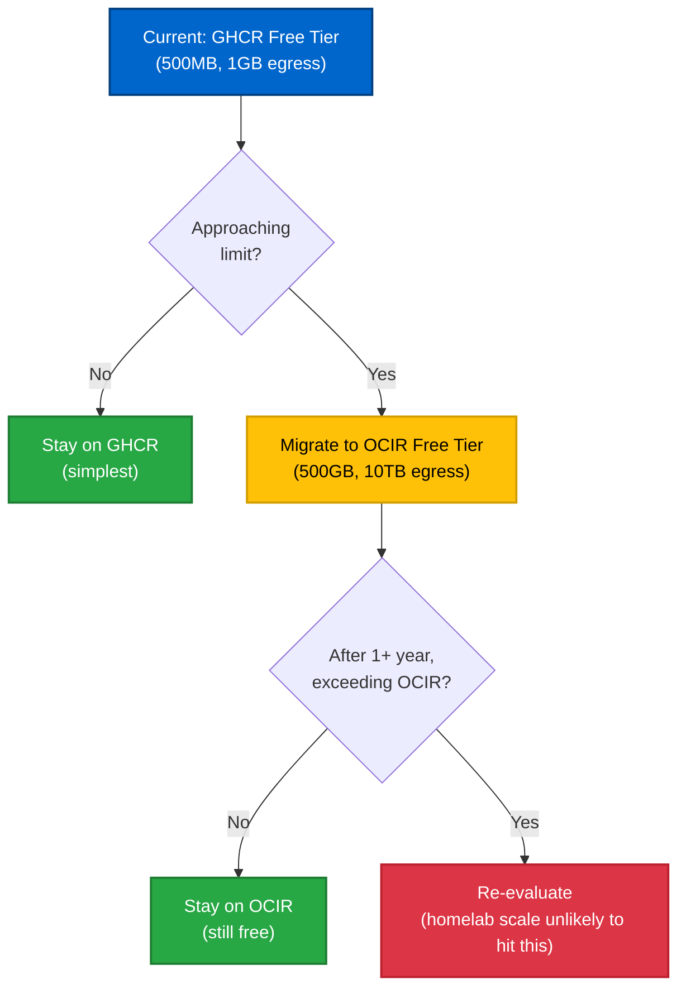
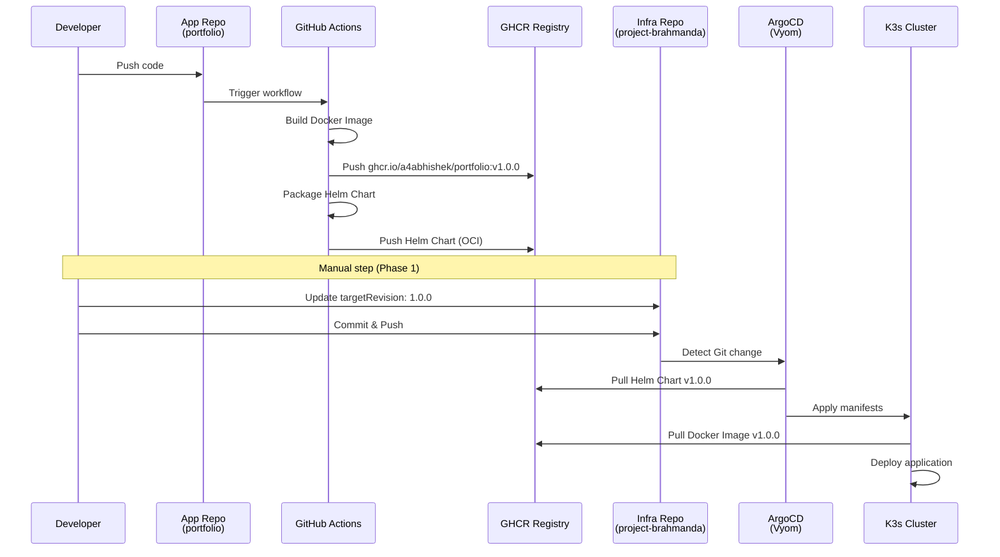
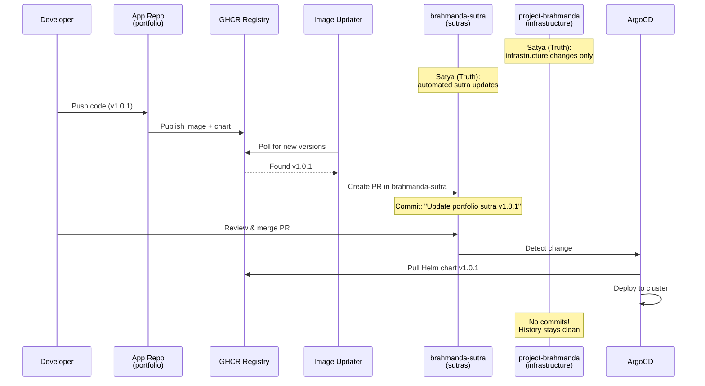
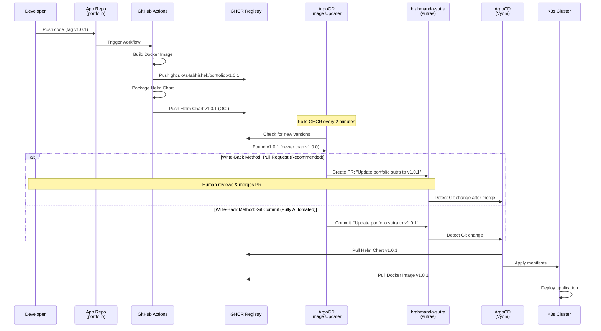
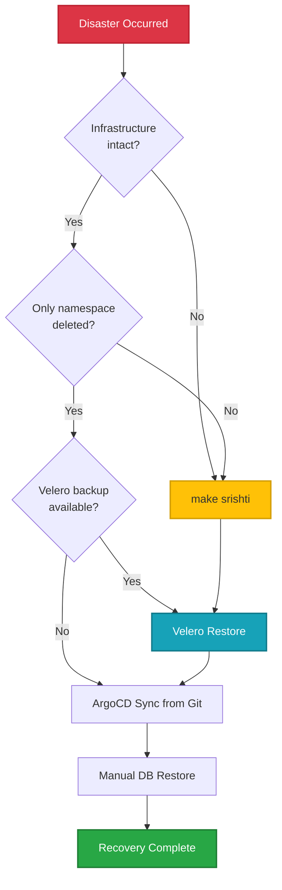
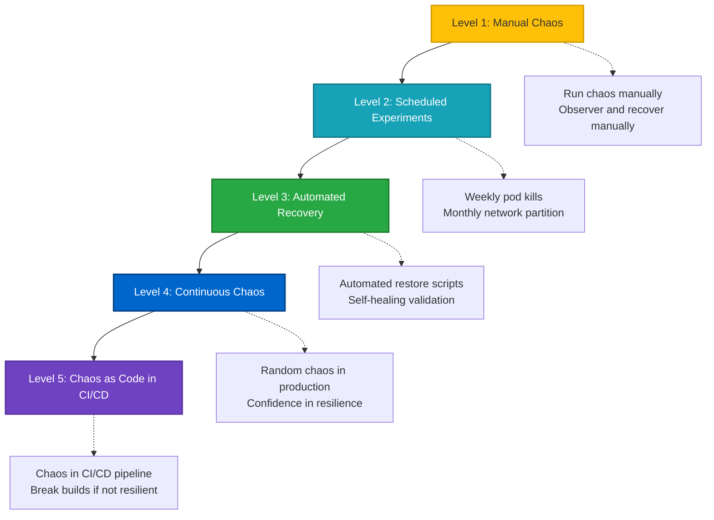

# **ADR-009: Visarga Deployment Architecture (Application Lifecycle Management)**

**Date:** 2026-02-03
**Status:** Accepted
**Related RFC:** [RFC-013-Visarga.md](../manthana/RFC-013-Visarga.md)
**Depends On:** [ADR-008-Ingress-And-DNS-Strategy.md](./ADR-008-Ingress-And-DNS-Strategy.md)

---
## Context
How do we deploy, update, and manage applications on Project Brahmanda's Kubernetes cluster while maintaining security, automation, and the principles of Asanga Shastra (Weapon of Detachment)?

> **Note:** This ADR focuses on application deployment (Visarga layer). For network ingress, DNS, and gateway architecture, see [ADR-008](./ADR-008-Ingress-And-DNS-Strategy.md).

## **Decision**

We will adopt a **GitOps-first, phased deployment architecture** using:

1. **ArgoCD** for continuous deployment (GitOps controller)
2. **GHCR (GitHub Container Registry)** for container images and Helm charts (Free tier, tight GitHub integration)
3. **ArgoCD Image Updater** for automated version management (Pull Request mode)
4. **Sealed Secrets** for secret management (encrypted secrets in Git, key stored in 1Password)
5. **Repository Separation:** `project-brahmanda` (infrastructure) + `brahmanda-sutra` (applications)

**Philosophy:** Sutras (eternal truths) are interpreted through Maya (the facade) into Sharira (running pods).

- **Atman (आत्मन्):** The immortal soul - `brahmanda-sutra` Git repository (immutable essence)
- **Sutra (सूत्र):** Concise eternal truths - ArgoCD Application manifests (condensed wisdom)
- **Maya (माया):** The divine facade - ArgoCD + Image Updater (machinery interpreting sutras)
- **Sharira (शरीर):** The mortal body - Running pods and services (temporary vessels)
- **Visarga (विसर्ग):** The act of creation - `make visarga` (the process of establishing Maya)

**Atman (Code/IaC) is Satya (truth)**, all manifestations (infrastructure, cluster, applications) are Maya - temporary projections that can be destroyed and recreated at will via `make pralaya` and `make srishti`.

---

## **Detailed Rationale**

### **1. Aligns with Asanga Shastra (Weapon of Detachment)**

- Infrastructure and applications can be destroyed and recreated from Git at will
- No manual ClickOps - everything declared in code
- Cluster state drifts toward Git (self-healing via ArgoCD)

### **2. Maintains Chakravyuh (Zero Trust Security)**

- Pull-based deployment (no inbound webhooks required)
- Sealed Secrets key stored in 1Password (part of Atman/code), deployed via Ansible (Nidhi framework)
- Network policies isolate application traffic from core systems
- Private `brahmanda-sutra` repository reduces attack surface

### **3. Supports Aparigraha (Frugality)**

- GHCR Free tier: Unlimited public images, generous storage
- No self-hosted Harbor/Artifactory (zero OpEx)
- ArgoCD Image Updater eliminates manual toil (free automation)

### **4. Enables Pragati (Eternal Progression - 99% Rule)**

- Phased approach ships value early, iterates rapidly
- Phase 1 deploys first application (portfolio website) within days
- Each subsequent phase adds capabilities without breaking existing workloads

### **5. Registry Cost Progression (Honoring Aparigraha)**

Our artifact storage strategy prioritizes zero recurring costs:



**Current Status:** Using GHCR Free tier. Migration to OCIR deferred until limits are approached.

---

## **Implementation Framework**

### **Integration with Existing IaC**

Visarga (Software Deployment Infrastructure) is the third phase of **srishti** after Sarga (Hardware and Base Infrastructure) or Samsara (CI/CD infrastructure). It is a **separate IaC layer** that runs **after** infrastructure is operational.

**Makefile Dependencies:**

```makefile
srishti: sarga samsara visarga  # Complete manifestation of functioning Brahmanda
  sarga: kshitiz vyom           # Foundation (edge + compute)
  samsara: brahmaloka           # Orchestration (CI/CD)
  visarga: maya                 # Application facade (depends on maya target)
```

**Execution Flow:**

```bash
make srishti
  ├─→ make sarga
  │    ├─→ make kshitiz      # Edge layer (AWS Lightsail)
  │    └─→ make vyom         # Compute layer (Proxmox VMs + K3s)
  ├─→ make samsara
  │    └─→ make brahmaloka   # Orchestration layer (GitHub Runners)
  └─→ make visarga           # Performs visarga (act of creation)
       └─→ make maya         # Creates Maya facade (ArgoCD + Image Updater) ← NEW
```

**Why Separate Layer:**

1. **Different Credentials:** Maya needs GitHub PAT (repo write access) + GHCR credentials, separate from AWS/Proxmox credentials
2. **Different Lifecycle:** Applications are more ephemeral (Sharira), infrastructure is more stable (foundation), but **both are transient (Anitya)** - only Atman (code) is Satya
3. **Different Lock:** Uses `brahmanda_lock_sutra` in Upstash (prevents concurrent ArgoCD/Image Updater changes)
4. **Kubernetes Dependency:** Requires K3s cluster operational (can't provision before Vyom)
5. **Philosophical Separation:** Sutra (application truths) + Maya (facade) are distinct from Samsara (infrastructure cycle)

**Implementation Strategy:**

- **Ansible:** Deploys ArgoCD, Image Updater, secrets, and all K8s resources
- **Makefile:** `make visarga` performs the act → depends on `maya` target (WITH_LOCK pattern)
- **Nidhi Framework:** Vault template (`group_vars/maya/vault.tpl.yml`) → encrypted vault (`group_vars/maya/vault.yml`)
- **No Terraform:** Maya provisions no infrastructure (VMs, IPs), only configures existing K3s cluster

**Credentials Management:**

```yaml
# 1Password vault structure (Project-Brahmanda)
GitHub-ArgoCD-Image-Updater-PAT:  # For Image Updater write-back
  username: a4abhishek
  credential: ghp_xxx  # repo scope

GHCR-Pull-Credentials:  # For private image pulls
  username: a4abhishek  
  password: ghp_yyy  # read:packages scope

ArgoCD-Admin-Password:  # For ArgoCD UI access (pre-defined)
  username: admin
  password: <strong-password>  # Defined in 1Password, not auto-generated
```

**Nidhi Framework Integration:**

```yaml
# samsara/ansible/group_vars/maya/vault.tpl.yml
---
# Maya (GitOps Facade) Ansible Vault Template
# Generated from: make nidhi-tirodhana VAULT=maya

# GitHub PAT for ArgoCD Image Updater (write-back to brahmanda-sutra)
github_username: "op://Project-Brahmanda/GitHub-ArgoCD-Image-Updater-PAT/username"
github_argocd_image_updater_pat: "op://Project-Brahmanda/GitHub-ArgoCD-Image-Updater-PAT/credential"

# GHCR credentials for private image pulls
ghcr_username: "op://Project-Brahmanda/GHCR-Pull-Credentials/username"
ghcr_password: "op://Project-Brahmanda/GHCR-Pull-Credentials/password"

# ArgoCD admin credentials (pre-configured, not auto-generated)
argocd_admin_username: "op://Project-Brahmanda/ArgoCD-Admin-Password/username"
argocd_admin_password: "op://Project-Brahmanda/ArgoCD-Admin-Password/password"

# Upstash credentials for lock verification
upstash_url: "op://Project-Brahmanda/Upstash-Sanchay-Token/UPSTASH_REDIS_REST_URL"
upstash_token: "op://Project-Brahmanda/Upstash-Sanchay-Token/UPSTASH_REDIS_REST_TOKEN"
```

**Generate encrypted vault:**

```bash
make nidhi-tirodhana VAULT=maya
# Creates: samsara/ansible/group_vars/maya/vault.yml (encrypted)
```

**Ansible Division:**

| Component | Method | Rationale |
|-----------|--------|----------|
| ArgoCD installation | Ansible (kubectl apply manifests) | K8s resource provisioning |
| Image Updater installation | Ansible (kubectl apply manifests) | Same as ArgoCD |
| Secrets (Git creds, GHCR) | Ansible (Nidhi vault → kubectl create secret) | Nidhi framework pattern |
| Sealed Secrets key | Ansible (restore from 1Password) | Disaster recovery via Nidhi |
| Maya repo bootstrap | Manual (one-time GitHub repo creation) | Not automatable (requires human decision) |
| Network Policies | Ansible (kubectl apply manifests) | Security policies as code |
| Distributed Locking | Makefile (WITH_LOCK macro) | Bash heredoc with Upstash REST API |

**Why No Terraform:**
- Maya provisions **zero infrastructure** (no VMs, static IPs, networks)
- Only configures K8s resources on existing cluster (Ansible's strength)
- Nidhi framework handles credentials (vault.tpl.yml → vault.yml)
- Makefile WITH_LOCK handles distributed locking (bash + curl to Upstash)
- Matches existing pattern: kshitiz/vyom/brahmaloka use Terraform for infrastructure, Ansible for configuration
- Maya is a facade layer, not infrastructure layer (philosophical consistency)

---

## **Implementation: The Four Phases**

**Agile Phasing Principle:** Each phase produces a working, demonstrable increment. Goal is to deploy portfolio website ASAP while maintaining security.

| Phase | Deliverable | Impact | Effort | Value |
| ----- | ----------- | ------ | ------ | ----- |
| **Phase 1** | Portfolio website deployed via ArgoCD + GHCR | 🟢 High | 🟢 Low | Deploy first app, validate GitOps |
| **Phase 2** | Automated updates via Image Updater + Sutra repo | 🟡 Medium | 🟡 Medium | Eliminate manual manifest updates |
| **Phase 3** | Sealed Secrets + Network Policies | 🟢 High | 🟢 Low | Production-grade security |
| **Phase 4** | Monitoring + Alerting | 🟡 Medium | 🟢 Low | Operational visibility |
| **Phase 5** | Disaster Recovery + Chaos Engineering | 🟢 High | 🟡 Medium | Resilience validation |

---

## **Phase 1: Foundation (Deploy First Application)**

**Goal:** Get portfolio website live on Brahmanda cluster using GitOps.

**Prerequisites:**

- K3s cluster operational (`make vyom` completed)
- Kubeconfig available (`make kubeconfig` executed)
- 1Password CLI authenticated (`op signin`)
- GitHub PAT with `repo` scope stored in 1Password

### **1.1 Execute Visarga (Create Maya Facade)**

**Run Makefile target:**

```bash
# From project root
make visarga  # Performs visarga (the act)
              # Internally calls: make maya (creates the facade)
```

**What this does:**

1. Acquires distributed lock (`brahmanda_lock_sutra` in Upstash) via Makefile WITH_LOCK macro
2. Runs `samsara/ansible/playbooks/04-bootstrap-maya.yml` to:
   - Install ArgoCD via official manifests
   - Store ArgoCD admin password in 1Password
   - Configure GHCR pull credentials
   - Deploy bootstrap ArgoCD Application
3. Releases lock on completion/failure

**Ansible Playbook (`samsara/ansible/playbooks/04-bootstrap-maya.yml`):**

```yaml
---
- name: Bootstrap Maya (GitOps Facade)
  hosts: localhost
  connection: local
  vars_files:
    - ../group_vars/brahmanda/vault.yml
    - ../group_vars/maya/vars.yml
    - ../group_vars/maya/vault.yml

  pre_tasks:
    - name: 🛡️ Verify Distributed Lock Ownership
      ansible.builtin.uri:
        url: "{{ upstash_url | trim }}/GET/brahmanda_lock_sutra"
        headers:
          Authorization: "Bearer {{ upstash_token | trim }}"
        return_content: true
      register: lock_status
      failed_when: lock_status.json.result != (brahmanda_job_id | default('MANUAL_RUN'))

    - name: 🔍 Verify Kubeconfig Access
      kubernetes.core.k8s_cluster_info:
      register: cluster_info

  tasks:
    - name: � Create ArgoCD Namespace
      kubernetes.core.k8s:
        state: present
        definition:
          apiVersion: v1
          kind: Namespace
          metadata:
            name: argocd

    - name: 🔑 Pre-configure ArgoCD Admin Password
      kubernetes.core.k8s:
        state: present
        definition:
          apiVersion: v1
          kind: Secret
          metadata:
            name: argocd-secret
            namespace: argocd
            labels:
              app.kubernetes.io/part-of: argocd
          type: Opaque
          stringData:
            # Bcrypt hash of password from 1Password
            admin.password: "{{ argocd_admin_password | password_hash('bcrypt') }}"
            # Optional: Also set initial admin password to same value
            admin.passwordMtime: "{{ ansible_date_time.iso8601 }}"

    - name: 📦 Install ArgoCD
      kubernetes.core.k8s:
        state: present
        definition: "{{ lookup('url', 'https://raw.githubusercontent.com/argoproj/argo-cd/stable/manifests/install.yaml', split_lines=False) }}"

    - name: ⏳ Wait for ArgoCD Server
      kubernetes.core.k8s_info:
        kind: Pod
        namespace: argocd
        label_selectors:
          - app.kubernetes.io/name=argocd-server
      register: argocd_pods
      until: argocd_pods.resources[0].status.phase == "Running"
      retries: 30
      delay: 10

    - name: 🔐 Create GHCR Pull Secret
      kubernetes.core.k8s:
        state: present
        definition:
          apiVersion: v1
          kind: Secret
          metadata:
            name: ghcr-pull-secret
            namespace: argocd
          type: kubernetes.io/dockerconfigjson
          data:
            .dockerconfigjson: "{{ lookup('onepassword', 'GHCR-Pull-Credentials', field='dockerconfigjson') }}"
```

**✅ Verification:**

```bash
# Check ArgoCD pods
kubectl get pods -n argocd

# Get admin password from 1Password (pre-configured, not auto-generated)
op read "op://Project-Brahmanda/ArgoCD-Admin-Password/password"

# Port-forward to access UI
kubectl port-forward svc/argocd-server -n argocd 8080:443
# Access: https://localhost:8080
# Username: admin
# Password: (from 1Password above)
```

---

### **1.2 Create Portfolio Helm Chart**

**Repository:** Your portfolio website repo (e.g., `github.com/a4abhishek/portfolio`)

**Repository Structure:**

```bash
portfolio/                   # Repository root
├── src/                     # Application source code
├── Dockerfile               # Container build definition
├── .github/
│   └── workflows/
│       └── release.yml      # Build & publish workflow
├── helm/                    # Helm chart (deployment manifests)
│   ├── Chart.yaml
│   ├── values.yaml
│   └── templates/
│       ├── deployment.yaml
│       ├── service.yaml
│       └── ingress.yaml
└── README.md
```

<details>
<summary><b>Chart.yaml</b></summary>

```yaml
apiVersion: v2
name: portfolio
description: Abhishek's Portfolio Website
type: application
version: 1.0.0  # Chart version
appVersion: "1.0.0"  # Application version
```

</details>

<details>
<summary><b>values.yaml</b></summary>

```yaml
replicaCount: 1

image:
  repository: ghcr.io/a4abhishek/portfolio
  tag: v1.0.0
  pullPolicy: IfNotPresent

service:
  type: ClusterIP
  port: 80

ingress:
  enabled: true
  className: traefik
  annotations:
    cert-manager.io/cluster-issuer: "letsencrypt-prod"
  hosts:
    # Production: Root domain for portfolio (primary identity)
    - host: abhishek-kashyap.com
      paths:
        - path: /
          pathType: Prefix
    # Homelab/Testing: Subdomain following ADR-008 pattern
    # - host: portfolio.abhishek-kashyap.com
    #   paths:
    #     - path: /
    #       pathType: Prefix
  tls:
    - secretName: portfolio-tls
      hosts:
        - abhishek-kashyap.com
        # - portfolio.abhishek-kashyap.com

resources:
  limits:
    cpu: 200m
    memory: 256Mi
  requests:
    cpu: 100m
    memory: 128Mi
```

</details>

<details>
<summary><b>templates/deployment.yaml</b></summary>

```yaml
apiVersion: apps/v1
kind: Deployment
metadata:
  name: {{ .Chart.Name }}
  labels:
    app: {{ .Chart.Name }}
spec:
  replicas: {{ .Values.replicaCount }}
  selector:
    matchLabels:
      app: {{ .Chart.Name }}
  template:
    metadata:
      labels:
        app: {{ .Chart.Name }}
    spec:
      containers:
      - name: {{ .Chart.Name }}
        image: "{{ .Values.image.repository }}:{{ .Values.image.tag }}"
        imagePullPolicy: {{ .Values.image.pullPolicy }}
        ports:
        - containerPort: 80
        resources:
          {{- toYaml .Values.resources | nindent 12 }}
```

</details>

<details>
<summary><b>templates/service.yaml</b></summary>

```yaml
apiVersion: v1
kind: Service
metadata:
  name: {{ .Chart.Name }}
spec:
  type: {{ .Values.service.type }}
  ports:
    - port: {{ .Values.service.port }}
      targetPort: 80
      protocol: TCP
  selector:
    app: {{ .Chart.Name }}
```

</details>

<details>
<summary><b>templates/ingress.yaml</b></summary>

```yaml
{{- if .Values.ingress.enabled -}}
apiVersion: networking.k8s.io/v1
kind: Ingress
metadata:
  name: {{ .Chart.Name }}
  annotations:
    {{- toYaml .Values.ingress.annotations | nindent 4 }}
spec:
  ingressClassName: {{ .Values.ingress.className }}
  tls:
  {{- range .Values.ingress.tls }}
  - hosts:
    {{- range .hosts }}
    - {{ . | quote }}
    {{- end }}
    secretName: {{ .secretName }}
  {{- end }}
  rules:
  {{- range .Values.ingress.hosts }}
  - host: {{ .host | quote }}
    http:
      paths:
      {{- range .paths }}
      - path: {{ .path }}
        pathType: {{ .pathType }}
        backend:
          service:
            name: {{ $.Chart.Name }}
            port:
              number: {{ $.Values.service.port }}
      {{- end }}
  {{- end }}
{{- end }}
```

</details>

---

### **1.3 Publish Helm Chart to GHCR**

```bash
# Navigate to Helm chart directory
pushd portfolio/helm/

# Package the chart
helm package .

# Login to GHCR
echo $GITHUB_TOKEN | helm registry login ghcr.io -u a4abhishek --password-stdin

# Push to GHCR (chart name comes from Chart.yaml)
helm push portfolio-1.0.0.tgz oci://ghcr.io/a4abhishek/charts

# Return to previous directory
popd
```

**✅ Verification:**

```bash
# Chart visible at: https://github.com/a4abhishek?tab=packages
```

---

### **1.4 Create brahmanda-sutra Repository**

**Philosophy:** Application manifests live in `brahmanda-sutra` (separate from infrastructure in `project-brahmanda`). This maintains clean separation: infrastructure code vs. application deployments.

**Sutra (सूत्र)** = Thread/Aphorism/Concise Formula. Like Patanjali's Yoga Sutras or Brahma Sutras, these manifests are concise declarations that encode complete application definitions.

```bash
# Create new private repository on GitHub
gh repo create a4abhishek/brahmanda-sutra --private --description "Application Sutras for Project Brahmanda (Concise eternal truths that manifest into running applications)"

# Clone and initialize
git clone https://github.com/a4abhishek/brahmanda-sutra.git
cd brahmanda-sutra
mkdir -p apps
```

**Create README:**

```bash
cat > README.md << 'EOF'
# Brahmanda Sutra (सूत्र)

> "Like the Yoga Sutras encode the essence of yoga in terse aphorisms, these manifests encode the essence of applications in concise YAML. Sutras are eternal (Satya/truth in Git), their interpretations manifest temporarily as Sharira (running pods)."

This repository contains ArgoCD Application manifests (sutras) for Project Brahmanda workloads.

## Philosophy
**Sutra:** Thread/Aphorism/Concise Formula. In Sanskrit tradition, sutras are terse statements encoding complete knowledge:
- Patanjali's Yoga Sutras (योग सूत्र)
- Brahma Sutras (ब्रह्म सूत्र)
- Nyaya Sutras (न्याय सूत्र)

**SRE Context:** ArgoCD Application manifests are like sutras—concise declarations (Atman/code) that ArgoCD interprets (Maya/facade) into running applications (Sharira/manifestation). When the cluster is destroyed (`make pralaya`), the Sharira vanishes, but the Sutras (Satya/truth) remain in Git. We recreate at will via `make srishti`.

## Structure
- `apps/` - ArgoCD Application CRDs (sutras) for each service

## Automated Updates
ArgoCD Image Updater monitors GHCR for new versions and automatically creates PRs to update image tags (configured in Phase 2).

## Related Repositories
- [project-brahmanda](https://github.com/a4abhishek/project-brahmanda) - Infrastructure code (Atman - contains Satya)
EOF

git add .
git commit -m "Initial commit: Application manifests"
git push
```

---

### **1.5 Create ArgoCD Application Manifest**

**Create Application manifest in brahmanda-sutra:**

```yaml
# brahmanda-sutra/apps/portfolio.yaml
apiVersion: argoproj.io/v1alpha1
kind: Application
metadata:
  name: portfolio
  namespace: argocd
  finalizers:
    - resources-finalizer.argocd.argoproj.io
spec:
  project: default
  source:
    repoURL: ghcr.io/a4abhishek/charts
    chart: portfolio
    targetRevision: 1.0.0
    helm:
      releaseName: portfolio
  destination:
    server: https://kubernetes.default.svc
    namespace: apps
  syncPolicy:
    automated:
      prune: true
      selfHeal: true
    syncOptions:
      - CreateNamespace=true
```

**Commit and push:**

```bash
# In brahmanda-sutra directory
git add apps/portfolio.yaml
git commit -m "feat: add portfolio application sutra"
git push
```

---

### **1.6 Configure ArgoCD Bootstrap in project-brahmanda**

**Create bootstrap Application** that monitors `brahmanda-sutra` repository:

```bash
# Switch to project-brahmanda directory
cd ../project-brahmanda
```

**Create bootstrap manifest:**

```yaml
# sankalpa/bootstrap.yaml
apiVersion: argoproj.io/v1alpha1
kind: Application
metadata:
  name: brahmanda-sutra
  namespace: argocd
  finalizers:
    - resources-finalizer.argocd.argoproj.io
spec:
  project: default
  source:
    repoURL: https://github.com/a4abhishek/brahmanda-sutra.git
    targetRevision: HEAD
    path: apps
    directory:
      recurse: true
  destination:
    server: https://kubernetes.default.svc
    namespace: argocd
  syncPolicy:
    automated:
      prune: true
      selfHeal: true
    syncOptions:
      - CreateNamespace=true
```

**Commit and push:**

```bash
git add sankalpa/bootstrap.yaml
git commit -m "feat(visarga): add brahmanda-sutra bootstrap application"
git push
```

---

### **1.7 Deploy Application**

```bash
# Apply the bootstrap Application (from project-brahmanda directory)
kubectl apply -f sankalpa/bootstrap.yaml

# Watch ArgoCD sync applications from brahmanda-sutra
kubectl get application -n argocd -w
```

**✅ Verification:**

```bash
# Check application status
kubectl get pods -n apps
kubectl get ingress -n apps

# Access portfolio (after DNS configuration)
curl https://abhishek-kashyap.com
```

**Visual Workflow:**



---

### **Phase 1 Deliverable Checklist**

- ✅ ArgoCD installed and accessible
- ✅ Portfolio Helm chart created and published to GHCR
- ✅ `brahmanda-sutra` repository created with portfolio application sutra
- ✅ Bootstrap Application configured in `project-brahmanda` (monitors sutra repo)
- ✅ Portfolio website deployed and accessible
- ✅ GitOps workflow validated (change in Git → automatic sync)

---

## **Phase 2: Automation (Eliminate Manual Toil)**

**Goal:** Automatically detect new portfolio versions and create PRs to update manifests.

**Prerequisites:** `brahmanda-sutra` repository created in Phase 1 with portfolio application sutra.

**Architectural Benefit:**



**Philosophy:** Infrastructure IaC repo (Atman - stable foundation code) stays clean. Application sutras (Atman - frequently changing code) are tracked separately for change velocity management.

---

### **2.1 Install ArgoCD Image Updater (via Ansible)**

**Extend Maya playbook** (`samsara/ansible/playbooks/04-bootstrap-maya.yml`):

```yaml
# Add to tasks section
- name: 📦 Install ArgoCD Image Updater
  kubernetes.core.k8s:
    state: present
    definition: "{{ lookup('url', 'https://raw.githubusercontent.com/argoproj-labs/argocd-image-updater/stable/manifests/install.yaml', split_lines=False) }}"
  tags: [image-updater]

- name: 🔐 Create Git Write-Back Credentials
  kubernetes.core.k8s:
    state: present
    definition:
      apiVersion: v1
      kind: Secret
      metadata:
        name: git-creds
        namespace: argocd
      type: Opaque
      stringData:
        username: "{{ github_username }}"
        password: "{{ github_argocd_image_updater_pat }}"
  tags: [image-updater]
```

**Credentials in vault** (`samsara/ansible/group_vars/maya/vault.yml`):

```yaml
# Generated via: make nidhi-tirodhana VAULT=maya
# Source: op://Admin-Project-Brahmanda/GitHub-ArgoCD-Image-Updater-PAT
$ANSIBLE_VAULT;1.1;AES256
...
github_username: a4abhishek
github_argocd_image_updater_pat: ghp_xxx
...
```

**Run update:**

```bash
# Re-run Maya facade with Image Updater tag
make visarga ANSIBLE_TAGS=image-updater
# OR directly:
make maya ANSIBLE_TAGS=image-updater
```

---

### **2.4 Verify Credentials**

```bash
# Check secret exists
kubectl get secret git-creds -n argocd

# Verify Image Updater pod
kubectl get pods -n argocd -l app.kubernetes.io/name=argocd-image-updater
```

---

### **2.3 Update Portfolio Application with Image Updater Annotations**

**Edit `brahmanda-sutra/apps/portfolio.yaml`:**

```yaml
apiVersion: argoproj.io/v1alpha1
kind: Application
metadata:
  name: portfolio
  namespace: argocd
  annotations:
    # Enable Image Updater
    argocd-image-updater.argoproj.io/image-list: portfolio=ghcr.io/a4abhishek/portfolio
    argocd-image-updater.argoproj.io/portfolio.update-strategy: semver:~1.0
    argocd-image-updater.argoproj.io/portfolio.pull-secret: pullsecret:argocd/ghcr-pull-secret

    # Write-back to brahmanda-sutra repo via Pull Request
    argocd-image-updater.argoproj.io/write-back-method: git:secret:argocd/git-creds
    argocd-image-updater.argoproj.io/git-branch: image-updater-{{.AppName}}
  finalizers:
    - resources-finalizer.argocd.argoproj.io
spec:
  project: default
  source:
    repoURL: ghcr.io/a4abhishek/charts
    chart: portfolio
    targetRevision: 1.0.0  # This will be auto-updated by Image Updater
    helm:
      releaseName: portfolio
  destination:
    server: https://kubernetes.default.svc
    namespace: apps
  syncPolicy:
    automated:
      prune: true
      selfHeal: true
    syncOptions:
      - CreateNamespace=true
```

**Commit and push:**

```bash
# In brahmanda-sutra directory
git add apps/portfolio.yaml
git commit -m "feat: enable automatic version updates via Image Updater"
git push
```

**Visual Workflow (Automated):**



**Key Benefit:** Developer pushes code → Image Updater creates PR → Human approves → Deployment happens. No manual manifest editing.

---

### **Phase 2 Deliverable Checklist**

- ✅ ArgoCD Image Updater installed
- ✅ Git write-back credentials configured
- ✅ Portfolio application configured with update annotations
- ✅ Automatic PR creation validated (publish new portfolio version, wait for PR)

> **📌 Phase 2 Implementation Note — Git Write-Back for OCI Helm Source:**
>
> The current Phase 1 setup uses `writeBackConfig.method: argocd` (Image Updater patches the Application spec directly in-cluster). This works but has a **cluster recreate problem**: after a full `make pralaya` + `make srishti`, the Application starts at the hardcoded `targetRevision` in git, then Image Updater patches it back to the latest — a 2-minute gap where the old version is running.
>
> Phase 2 must replace this with `method: git`. Because the Application source is OCI Helm (not a git repo), a **multi-source Application** is required:
> - **Source 1:** OCI Helm chart at `ghcr.io` (current)
> - **Source 2:** A git path in `brahmanda-sutra` (e.g., `apps/params/portfolio/`) where Image Updater writes a `values.yaml` override file. ArgoCD merges it onto Source 1 via `helm.valueFiles`.
>
> This restores full Asanga Shastra compliance: `brahmanda-sutra` always reflects the latest deployed version, and a fresh cluster converges in one sync with no intermediate wrong-version state.

---

## **Phase 3: Security Hardening (Chakravyuh Defense)**

**Goal:** Production-grade security without compromising GitOps workflow.

### **3.1 Install Sealed Secrets Controller**

```bash
helm repo add sealed-secrets https://bitnami-labs.github.io/sealed-secrets
helm install sealed-secrets sealed-secrets/sealed-secrets \
  -n kube-system \
  --set fullnameOverride=sealed-secrets-controller
```

**✅ Verification:**

```bash
kubectl get pods -n kube-system -l app.kubernetes.io/name=sealed-secrets
```

---

### **3.2 Backup Sealed Secrets Key to 1Password (Nidhi Framework)**

```bash
# Extract the key
kubectl get secret -n kube-system -l sealedsecrets.bitnami.com/sealed-secrets-key=active \
  -o yaml > sealed-secrets-key.yaml

# Store in 1Password
op item create --category "Secure Note" \
  --title "sealed-secrets-key" \
  --vault "Admin-Project-Brahmanda" \
  notesPlain="$(cat sealed-secrets-key.yaml)"

# Clean up local copy
rm sealed-secrets-key.yaml
```

---

### **3.3 Configure Vyom Bootstrap Ansible Playbook**

**Add task to deploy Sealed Secrets key:**

```yaml
# samsara/ansible/playbooks/vyom-bootstrap.yml
---
- name: Bootstrap Vyom Cluster
  hosts: vyom
  tasks:
    - name: Deploy Sealed Secrets key from 1Password (Nidhi framework)
      kubernetes.core.k8s:
        definition: "{{ lookup('community.general.onepassword', 'sealed-secrets-key', vault='Admin-Project-Brahmanda') }}"
        state: present
      when: sealed_secrets_key_exists is not defined or not sealed_secrets_key_exists

    - name: Verify Sealed Secrets controller is ready
      kubernetes.core.k8s_info:
        kind: Pod
        namespace: kube-system
        label_selectors:
          - app.kubernetes.io/name=sealed-secrets
      register: sealed_secrets_pods
      until: sealed_secrets_pods.resources[0].status.phase == "Running"
      retries: 30
      delay: 10
```

---

### **3.4 Create Sealed Secrets for Applications**

**Example: GHCR Pull Secret (if using private images)**

```bash
# Create plain secret
kubectl create secret docker-registry ghcr-pull-secret \
  --docker-server=ghcr.io \
  --docker-username=a4abhishek \
  --docker-password="$(op read 'op://Admin-Project-Brahmanda/github-packages-pat/credential')" \
  --docker-email=your-email@example.com \
  -n apps --dry-run=client -o yaml > ghcr-pull-secret.yaml

# Seal the secret
kubeseal --format yaml < ghcr-pull-secret.yaml > sealed-ghcr-pull-secret.yaml

# Clean up plain secret
rm ghcr-pull-secret.yaml
```

**Commit sealed secret to Sutra repo:**

```bash
# brahmanda-sutra/apps/sealed-secrets/ghcr-pull-secret.yaml
mv sealed-ghcr-pull-secret.yaml brahmanda-sutra/apps/sealed-secrets/

cd brahmanda-sutra
git add apps/sealed-secrets/ghcr-pull-secret.yaml
git commit -m "feat: add GHCR pull secret (sealed)"
git push
```

---

### **3.5 Apply Network Policies (Zero Trust)**

**Create network policy for apps namespace:**

```yaml
# brahmanda-sutra/apps/network-policies/deny-all-ingress.yaml
apiVersion: networking.k8s.io/v1
kind: NetworkPolicy
metadata:
  name: deny-all-ingress
  namespace: apps
spec:
  podSelector: {}
  policyTypes:
    - Ingress
```

**Allow ingress from Traefik:**

```yaml
# brahmanda-sutra/apps/network-policies/allow-traefik-ingress.yaml
apiVersion: networking.k8s.io/v1
kind: NetworkPolicy
metadata:
  name: allow-traefik-ingress
  namespace: apps
spec:
  podSelector:
    matchLabels:
      app: portfolio  # Adjust per application
  policyTypes:
    - Ingress
  ingress:
    - from:
      - namespaceSelector:
          matchLabels:
            name: kube-system
        podSelector:
          matchLabels:
            app.kubernetes.io/name: traefik
      ports:
        - protocol: TCP
          port: 80
```

**Commit and push:**

```bash
git add apps/network-policies/
git commit -m "feat: add zero-trust network policies"
git push
```

---

### **Phase 3 Deliverable Checklist**

- ✅ Sealed Secrets controller installed
- ✅ Sealed Secrets key backed up to 1Password
- ✅ Vyom bootstrap playbook configured to restore key
- ✅ Sealed secrets created for sensitive data
- ✅ Network policies applied (deny-all + allow-ingress)
- ✅ Security validated (no plain secrets in Git)

---

## **Phase 4: Monitoring & Observability**

**Goal:** Gain visibility into cluster and application health, resource usage, and performance metrics.

### **4.1 Deploy Prometheus + Grafana**

```yaml
# project-brahmanda/sankalpa/observability/kube-prometheus-stack.yaml
apiVersion: argoproj.io/v1alpha1
kind: Application
metadata:
  name: kube-prometheus-stack
  namespace: argocd
spec:
  project: default
  source:
    repoURL: https://prometheus-community.github.io/helm-charts
    chart: kube-prometheus-stack
    targetRevision: 55.x.x
    helm:
      releaseName: kube-prometheus-stack
      values: |
        grafana:
          adminPassword: "{{ lookup('onepassword', 'grafana-admin-password', vault='Admin-Project-Brahmanda') }}"
          ingress:
            enabled: true
            hosts:
              - grafana.brahmanda.abhishek-kashyap.com
  destination:
    server: https://kubernetes.default.svc
    namespace: observability
  syncPolicy:
    automated:
      prune: true
      selfHeal: true
    syncOptions:
      - CreateNamespace=true
```

---

### **Phase 4 Deliverable Checklist**

- ✅ Prometheus + Grafana deployed
- ✅ Application metrics visible in Grafana
- ✅ Cluster resource dashboards configured
- ✅ Alert rules defined for critical conditions
- ✅ Notification channels configured (email/Slack)

---

## **Phase 5: Disaster Recovery & Resilience**

**Goal:** Ensure cluster and applications can recover from failures, and validate recovery through chaos engineering.

### **5.1 Install Velero for Kubernetes Backups**

**Philosophy:** `brahmanda-sutra` contains desired state (Satya/truth), but **runtime state** (StatefulSet data, volumes, operator-created resources) needs backup.

**What Velero Backs Up:**
- Persistent Volumes (Longhorn snapshots)
- StatefulSet data (databases, message queues)
- Runtime-created ConfigMaps/Secrets (not in Git)
- Custom Resource instances (ArgoCD Applications, etc.)

**What We Don't Backup:**
- Declarative manifests (already in `brahmanda-sutra` Git repo)
- Stateless application pods (recreated from Git)
- ArgoCD itself (reinstalled via `make visarga`)

**Install Velero:**

```bash
# Install Velero CLI
wget https://github.com/vmware-tanzu/velero/releases/download/v1.12.0/velero-v1.12.0-linux-amd64.tar.gz
tar -xvf velero-v1.12.0-linux-amd64.tar.gz
sudo mv velero-v1.12.0-linux-amd64/velero /usr/local/bin/

# Install Velero server with Cloudflare R2 backend
velero install \
  --provider aws \
  --plugins velero/velero-plugin-for-aws:v1.8.0 \
  --bucket brahmanda-velero-backups \
  --secret-file ./credentials-velero \
  --backup-location-config region=auto,s3ForcePathStyle="true",s3Url=https://<account-id>.r2.cloudflarestorage.com \
  --snapshot-location-config region=auto \
  --use-volume-snapshots=true \
  --uploader-type=restic
```

**Credentials file** (`credentials-velero`):

```ini
[default]
aws_access_key_id=<R2-ACCESS-KEY>
aws_secret_access_key=<R2-SECRET-KEY>
```

**Install Longhorn CSI plugin for Velero:**

```bash
kubectl apply -f https://raw.githubusercontent.com/longhorn/longhorn/v1.5.1/deploy/velero-plugin/velero-plugin.yaml
```

**Configure scheduled backups:**

```yaml
# brahmanda-sutra/apps/velero/backup-schedule.yaml
apiVersion: velero.io/v1
kind: Schedule
metadata:
  name: daily-backup
  namespace: velero
spec:
  schedule: "0 2 * * *"  # 2 AM daily
  template:
    includedNamespaces:
      - apps                # Application workloads
      - observability       # Prometheus/Grafana data
      - argocd              # ArgoCD state (Applications)
    excludedNamespaces:
      - kube-system         # System components (recreated from code)
      - kube-public
      - kube-node-lease
    storageLocation: default
    volumeSnapshotLocations:
      - default
    ttl: 720h0m0s  # 30 days retention
```

**Backup StatefulSets specifically:**

```yaml
# brahmanda-sutra/apps/velero/statefulset-backup.yaml
apiVersion: velero.io/v1
kind: Schedule
metadata:
  name: statefulset-backup
  namespace: velero
spec:
  schedule: "0 */6 * * *"  # Every 6 hours
  template:
    labelSelector:
      matchLabels:
        backup.velero.io/stateful: "true"  # Label StatefulSets with this
    snapshotVolumes: true
    includeClusterResources: false
    ttl: 168h0m0s  # 7 days retention
```

**Label StatefulSets for backup:**

```yaml
# In your StatefulSet manifests
metadata:
  labels:
    backup.velero.io/stateful: "true"
```

**✅ Verification:**

```bash
# Check Velero installation
kubectl get pods -n velero

# List backup schedules
velero schedule get

# Trigger manual backup
velero backup create manual-backup --include-namespaces apps

# Check backup status
velero backup describe manual-backup
```

---

### **5.2 Configure Application-Specific Backups**

**For databases and stateful applications, Velero volume snapshots alone aren't enough. Add application-consistent backups:**

**Example: PostgreSQL Database Backup (if deployed):**

```yaml
# brahmanda-sutra/apps/postgres/backup-cronjob.yaml
apiVersion: batch/v1
kind: CronJob
metadata:
  name: postgres-backup
  namespace: apps
spec:
  schedule: "0 1 * * *"  # 1 AM daily
  jobTemplate:
    spec:
      template:
        spec:
          containers:
          - name: backup
            image: postgres:15
            command:
            - /bin/sh
            - -c
            - |
              pg_dump -h postgres-svc -U postgres -d mydb | \
              gzip > /backup/mydb-$(date +%Y%m%d-%H%M%S).sql.gz
              # Upload to R2 using rclone or aws-cli
              rclone copy /backup/ r2:brahmanda-db-backups/postgres/
            volumeMounts:
            - name: backup
              mountPath: /backup
          restartPolicy: OnFailure
          volumes:
          - name: backup
            emptyDir: {}
```

**Example: etcd Backup (if running self-managed etcd):**

```bash
# Add to StatefulSet backup annotations
metadata:
  annotations:
    pre.hook.backup.velero.io/command: '["etcdctl", "snapshot", "save", "/backup/etcd-snapshot.db"]'
    post.hook.backup.velero.io/command: '["rm", "/backup/etcd-snapshot.db"]'
```

---

### **5.3 Configure Longhorn Volume Snapshots**

```yaml
# project-brahmanda/sankalpa/core/longhorn-backup.yaml
apiVersion: v1
kind: Secret
metadata:
  name: longhorn-backup-credentials
  namespace: longhorn-system
type: Opaque
stringData:
  AWS_ACCESS_KEY_ID: "{{ lookup('onepassword', 'cloudflare-r2-access-key', vault='Admin-Project-Brahmanda') }}"
  AWS_SECRET_ACCESS_KEY: "{{ lookup('onepassword', 'cloudflare-r2-secret-key', vault='Admin-Project-Brahmanda') }}"
  AWS_ENDPOINTS: "https://<account-id>.r2.cloudflarestorage.com"
---
apiVersion: longhorn.io/v1beta2
kind: BackupTarget
metadata:
  name: default
  namespace: longhorn-system
spec:
  backupTargetURL: s3://brahmanda-backups@us-east-1/
  credentialSecret: longhorn-backup-credentials
```

---

### **5.4 Test Disaster Recovery**

**Simulated Pralaya (Destruction) with Full Recovery:**

```bash
# ========================================
# Phase 1: Pre-Destruction Backup
# ========================================

# 1. Take final Velero backup
velero backup create pre-pralaya-backup \
  --include-namespaces apps,observability,argocd \
  --wait

# 2. Verify backup completed
velero backup describe pre-pralaya-backup

# 3. Take application-specific backups (if any databases)
kubectl exec -n apps postgres-0 -- pg_dump -U postgres mydb > mydb-backup.sql

# 4. Export Longhorn volume list (for verification)
kubectl get pv -o yaml > longhorn-volumes-backup.yaml

# ========================================
# Phase 2: Destruction (Simulated)
# ========================================

# 5. Delete application namespaces (simulated cluster failure)
kubectl delete namespace apps observability --wait

# OR full cluster rebuild:
# make pralaya  # Destroys entire infrastructure

# ========================================
# Phase 3: Infrastructure Recreation
# ========================================

# 6. Rebuild infrastructure (if full pralaya)
make srishti
# This runs:
#   - make sarga   (kshitiz + vyom)
#   - make samsara (brahmaloka)
#   - make visarga (maya - ArgoCD + Image Updater)

# 7. Vyom bootstrap automatically:
#   - Deploys K3s
#   - Restores Sealed Secrets key from 1Password
#   - Installs Longhorn

# ========================================
# Phase 4: Application State Recovery
# ========================================

# 8. Reinstall Velero (if full cluster rebuild)
velero install --provider aws \
  --plugins velero/velero-plugin-for-aws:v1.8.0 \
  --bucket brahmanda-velero-backups \
  --secret-file ./credentials-velero \
  --backup-location-config region=auto,s3ForcePathStyle="true",s3Url=https://<account-id>.r2.cloudflarestorage.com

# 9. Restore from Velero backup
velero restore create pre-pralaya-restore \
  --from-backup pre-pralaya-backup \
  --wait

# 10. Verify restoration
velero restore describe pre-pralaya-restore
kubectl get all -n apps
kubectl get pvc -n apps

# 11. Deploy ArgoCD bootstrap (recreates declarative resources from Git)
kubectl apply -f sankalpa/bootstrap.yaml

# 12. ArgoCD syncs all applications from brahmanda-sutra
#     (This ensures Git state matches cluster state)
kubectl get application -n argocd -w

# 13. Restore application-specific data (if needed)
#     (For databases that weren't part of PVC snapshots)
cat mydb-backup.sql | kubectl exec -i -n apps postgres-0 -- psql -U postgres mydb

# ========================================
# Phase 5: Verification
# ========================================

# 14. Verify StatefulSets are running
kubectl get statefulset -A
kubectl get pods -n apps -l backup.velero.io/stateful=true

# 15. Verify PVCs are bound
kubectl get pvc -A

# 16. Verify application health
kubectl exec -n apps <pod-name> -- <health-check-command>

# 17. Verify data integrity
# Check database row counts, file checksums, etc.

# 18. Test application functionality
curl https://abhishek-kashyap.com
```

**Recovery Decision Tree:**



**Backup Hierarchy (Recovery Order):**

1. **Infrastructure as Code** (Atman/Satya - Truth in Git)
   - Source: `project-brahmanda` repository
   - Recovery: `make srishti`
   
2. **Application Definitions** (Atman/Satya - Sutras in Git)
   - Source: `brahmanda-sutra` repository
   - Recovery: ArgoCD sync after bootstrap
   
3. **Runtime State** (Maya - Temporary manifestation)
   - Source: Velero backups in R2
   - Recovery: `velero restore`
   
4. **Persistent Data** (Sharira - Application body)
   - Source: Longhorn volume snapshots + DB dumps
   - Recovery: Velero PVC restore + manual DB import

**Backup vs Git Decision Matrix:**

| Resource Type | In Git? | Needs Backup? | Backup Method |
|---------------|---------|---------------|---------------|
| Deployment YAML | ✅ Yes (`brahmanda-sutra`) | ❌ No | Recreate from Git |
| StatefulSet YAML | ✅ Yes (`brahmanda-sutra`) | ❌ No | Recreate from Git |
| Service YAML | ✅ Yes (`brahmanda-sutra`) | ❌ No | Recreate from Git |
| ConfigMap (declarative) | ✅ Yes (`brahmanda-sutra`) | ❌ No | Recreate from Git |
| ConfigMap (operator-created) | ❌ No | ✅ Yes | Velero backup |
| Secret (Sealed) | ✅ Yes (encrypted in Git) | ❌ No | Recreate from Git |
| Secret (runtime) | ❌ No | ✅ Yes | Velero backup |
| PVC (empty) | ✅ Yes (`brahmanda-sutra`) | ❌ No | Recreate from Git |
| PVC (with data) | ❌ No | ✅ Yes | Velero + Longhorn |
| Database data | ❌ No | ✅ Yes | pg_dump + Velero |
| ArgoCD Application | ✅ Yes (`brahmanda-sutra`) | ❌ No | Recreate from Git |
| ArgoCD sync state | ❌ No | ⚠️ Optional | Velero (nice-to-have) |

---

### **5.5 Chaos Engineering (Validate Recovery Automation)**

**Philosophy:** Testing disaster recovery manually is good. **Continuously** testing it with automated chaos is better. Chaos engineering validates that Asanga Shastra (Weapon of Detachment) works in practice, not just theory.

**Why Chaos Engineering for Homelab:**
- **Learning Value:** Experience real failure modes (pod crashes, network splits, disk corruption)
- **Validates DR:** Automated verification that `make srishti` actually recovers the system
- **Production Practice:** Learn same tools used by Netflix, Google, Amazon
- **Confidence Building:** Know your recovery procedures work before you need them

**Tool Selection: Chaos Mesh**
- CNCF project (production-grade, actively maintained)
- Kubernetes-native (installs as CRDs)
- Comprehensive failure types (pod, network, IO, time, kernel)
- Free and open-source (Aparigraha principle)
- Web UI for visualization (learning-friendly)

**Install Chaos Mesh:**

```bash
# Add Chaos Mesh Helm repo
helm repo add chaos-mesh https://charts.chaos-mesh.org
helm repo update

# Install Chaos Mesh
helm install chaos-mesh chaos-mesh/chaos-mesh \
  --namespace chaos-mesh \
  --create-namespace \
  --set dashboard.create=true \
  --set dashboard.ingress.enabled=true \
  --set dashboard.ingress.hosts[0]=chaos.vyom.abhishek-kashyap.com
```

**Access Dashboard:**

```bash
kubectl port-forward -n chaos-mesh svc/chaos-dashboard 2333:2333
# Access: http://localhost:2333
```

---

**Chaos Experiments (Progressive Complexity):**

**1. Pod Failure (Beginner):**

Test StatefulSet recovery:

```yaml
# brahmanda-sutra/apps/chaos/pod-kill-experiment.yaml
apiVersion: chaos-mesh.org/v1alpha1
kind: PodChaos
metadata:
  name: pod-kill-test
  namespace: chaos-mesh
spec:
  action: pod-kill
  mode: one  # Kill one pod at random
  selector:
    namespaces:
      - apps
    labelSelectors:
      backup.velero.io/stateful: "true"  # Target StatefulSets
  scheduler:
    cron: "@every 6h"  # Every 6 hours
  duration: "1m"
```

**Expected Outcome:**
- StatefulSet controller recreates pod
- PVC reattaches to new pod
- Application recovers automatically
- Prometheus alerts fire (verify alerting works)

---

**2. Network Partition (Intermediate):**

Test split-brain scenarios:

```yaml
# brahmanda-sutra/apps/chaos/network-partition.yaml
apiVersion: chaos-mesh.org/v1alpha1
kind: NetworkChaos
metadata:
  name: partition-test
  namespace: chaos-mesh
spec:
  action: partition
  mode: all
  selector:
    namespaces:
      - apps
    labelSelectors:
      app: portfolio
  direction: both
  duration: "2m"
  scheduler:
    cron: "0 3 * * 0"  # Weekly on Sunday 3 AM
```

**Expected Outcome:**
- Application becomes unreachable
- Ingress health checks fail
- ArgoCD detects unhealthy state
- After 2m, network recovers automatically

---

**3. Persistent Volume Corruption (Advanced):**

Test Velero restore from backup:

```yaml
# brahmanda-sutra/apps/chaos/io-chaos.yaml
apiVersion: chaos-mesh.org/v1alpha1
kind: IOChaos
metadata:
  name: disk-corruption-test
  namespace: chaos-mesh
spec:
  action: mixed
  mode: one
  selector:
    namespaces:
      - apps
    labelSelectors:
      backup.velero.io/stateful: "true"
  volumePath: /var/lib/postgresql/data  # Database volume
  path: "**/*.db"
  percent: 10  # Corrupt 10% of reads/writes
  duration: "5m"
  scheduler:
    cron: "0 4 * * 6"  # Saturday 4 AM (before Sunday backup verification)
```

**Recovery Workflow:**
```bash
# 1. Chaos experiment corrupts disk
# 2. Database starts failing queries
# 3. Manual intervention: Restore from Velero backup
velero restore create io-chaos-recovery \
  --from-backup daily-backup-20260202 \
  --include-namespaces apps

# 4. Verify data integrity after restore
kubectl exec -n apps postgres-0 -- psql -c "SELECT COUNT(*) FROM users;"
```

---

**4. Complete Cluster Failure (Expert):**

**Automated Pralaya-Srishti Test:**

```bash
# brahmanda-sutra/apps/chaos/cluster-rebuild-test.sh
#!/bin/bash
set -euo pipefail

echo "=== CHAOS TEST: Complete Cluster Rebuild ==="

# 1. Backup current state
echo "📸 Taking pre-chaos backup..."
velero backup create chaos-test-backup --wait

# 2. Destroy cluster (simulated)
echo "💥 Destroying cluster..."
kubectl delete namespace apps observability --wait

# 3. Rebuild via automation
echo "🔨 Rebuilding cluster..."
make srishti  # Full infrastructure recreation

# 4. Restore from backup
echo "📦 Restoring from backup..."
velero restore create chaos-test-restore \
  --from-backup chaos-test-backup \
  --wait

# 5. Verify all applications healthy
echo "✅ Verifying applications..."
kubectl wait --for=condition=Ready pod -l backup.velero.io/stateful=true -n apps --timeout=600s

# 6. Run smoke tests
echo "🧪 Running smoke tests..."
curl -f https://abhishek-kashyap.com || exit 1

echo "✅ Chaos test PASSED: Full recovery successful"
```

**Schedule monthly:**

```yaml
# brahmanda-sutra/apps/chaos/monthly-cluster-rebuild.yaml
apiVersion: batch/v1
kind: CronJob
metadata:
  name: monthly-cluster-rebuild
  namespace: chaos-mesh
spec:
  schedule: "0 5 1 * *"  # 1st of every month, 5 AM
  jobTemplate:
    spec:
      template:
        spec:
          containers:
          - name: rebuild-test
            image: bitnami/kubectl:latest
            command: ["/scripts/cluster-rebuild-test.sh"]
            volumeMounts:
            - name: script
              mountPath: /scripts
          restartPolicy: OnFailure
          volumes:
          - name: script
            configMap:
              name: cluster-rebuild-script
              defaultMode: 0755
```

---

**Chaos Engineering Maturity Ladder:**



**Recommended Path for Homelab:**
1. **Phase 1 (Start):** Manual chaos via dashboard (learning failure modes)
2. **Phase 2 (Month 2):** Weekly pod kills (validate StatefulSet recovery)
3. **Phase 3 (Month 3):** Monthly cluster rebuild (validate full DR)
4. **Phase 4 (Month 6):** Continuous chaos in test namespace (confidence building)
5. **Phase 5 (Year 1):** Chaos in CI/CD (production-grade practices)

---

**Safety Guardrails:**

```yaml
# brahmanda-sutra/apps/chaos/safety-policy.yaml
apiVersion: chaos-mesh.org/v1alpha1
kind: Schedule
metadata:
  name: chaos-safety
  namespace: chaos-mesh
spec:
  # Only run chaos during maintenance windows
  startingDeadlineSeconds: 300
  historyLimit: 10
  
  # Pause chaos if critical alerts firing
  pause:
    - condition: "kube-system pods not Ready"
    - condition: "Critical alerts in Prometheus"
```

**Monitoring Integration:**

```yaml
# Grafana dashboard for chaos experiments
# brahmanda-sutra/apps/grafana/chaos-dashboard.json
{
  "dashboard": {
    "title": "Chaos Engineering",
    "panels": [
      {
        "title": "Active Chaos Experiments",
        "targets": [{
          "expr": "count(chaos_mesh_experiments{status='running'})"
        }]
      },
      {
        "title": "Recovery Time",
        "targets": [{
          "expr": "histogram_quantile(0.95, chaos_mesh_recovery_time_seconds)"
        }]
      },
      {
        "title": "Failure Injection Success Rate",
        "targets": [{
          "expr": "rate(chaos_mesh_inject_success[5m])"
        }]
      }
    ]
  }
}
```

---

**Learning Outcomes:**

After implementing chaos engineering, you will understand:
- **Real failure modes:** Not just theoretical (network splits, disk corruption, memory pressure)
- **MTTR (Mean Time To Recovery):** How long does it actually take to recover?
- **Bottlenecks:** Where does recovery slow down? (DNS propagation, image pulls, volume reattachment)
- **Alerting gaps:** Which failures don't trigger alerts? (Fix monitoring)
- **Documentation gaps:** Where are recovery procedures unclear? (Update runbooks)
- **Automation gaps:** What still requires manual intervention? (Automate it)

**Chaos Engineering as Learning Tool:**
- Run pod-kill → Learn Kubernetes reconciliation loops
- Run network partition → Learn service mesh behavior
- Run disk corruption → Learn volume snapshot/restore
- Run cluster rebuild → Learn IaC recovery patterns

**This transforms DR from "we think it works" to "we know it works because we break it monthly."**

---

### **Phase 5 Deliverable Checklist**

- ✅ Velero installed with R2 backend
- ✅ Scheduled backups configured (daily full + 6-hour StatefulSet)
- ✅ Longhorn volume snapshots integrated with Velero
- ✅ Application-specific backups configured (database dumps)
- ✅ Disaster recovery tested (full cluster recreation + restore)
- ✅ Backup/restore procedures documented
- ✅ Recovery decision tree validated
- ✅ Chaos Mesh installed with web dashboard
- ✅ Chaos experiments defined (pod-kill, network partition, IO corruption)
- ✅ Automated chaos schedule configured (progressive complexity)
- ✅ Chaos-driven improvements documented (alerting gaps, automation opportunities)

---

## **Consequences**

### **Positive**

- ✅ **Asanga Shastra:** Entire application stack can be destroyed and recreated from Git
- ✅ **Aparigraha:** Zero recurring costs (GHCR Free tier, self-managed ArgoCD)
- ✅ **Chakravyuh:** Pull-based GitOps, no inbound webhooks, secrets encrypted in Git
- ✅ **Satya:** Git is single source of truth (1Password for secrets)
- ✅ **Pragati:** Phased approach ships portfolio website in Phase 1, iterates to maturity
- ✅ **Solo-friendly:** No team coordination overhead, but scales for future collaboration
- ✅ **Learning-optimized:** Each phase teaches production patterns (GitOps, automation, security, operations)

### **Negative**

- ⚠️ **Initial complexity:** ArgoCD + Image Updater + Sealed Secrets is heavier than `kubectl apply`
- ⚠️ **PR review overhead:** Image Updater creates PRs (can switch to direct commit if desired)
- ⚠️ **GHCR coupling:** Switching registries requires sutra updates across all applications
- ⚠️ **Sealed Secrets key management:** Must backup key to 1Password (critical for cluster recreation)

### **Mitigation**

- Complexity justified by production-grade practices (learning value)
- PR mode enables review before deployment (security > convenience)
- GHCR provides excellent GitHub integration (acceptable coupling)
- Nidhi framework automates key management via Ansible

---

## **Compliance**

### **Asanga Shastra (Weapon of Detachment)**

✅ **PASS:** Cluster can be destroyed and recreated from:

- Infrastructure: `project-brahmanda` Git repository
- Applications: `brahmanda-sutra` Git repository (sutras encode eternal truths)
- Secrets: 1Password (Admin-Project-Brahmanda vault)
- State: Terraform state in Upstash, sealed secrets key in 1Password

### **Chakravyuh (Labyrinth Defense)**

✅ **PASS:**

- Pull-based deployment (no inbound ports)
- Network policies enforce zero-trust
- Secrets encrypted in Git (Sealed Secrets)
- Private `brahmanda-sutra` repo (reduced attack surface)

### **Satya (Absolute Truth)**

✅ **PASS:**

- Git is source of truth for manifests
- 1Password is source of truth for secrets
- Cluster state drifts toward Git (ArgoCD self-heal)

### **Aparigraha (Frugality)**

✅ **PASS:**

- GHCR Free tier (zero cost)
- Self-managed ArgoCD (zero cost)
- Cloudflare R2 Free tier for backups (zero cost)

### **Pragati (Eternal Progression)**

✅ **PASS:**

- Phase 1 ships portfolio website (immediate value)
- Each phase builds on previous (iterative)
- 5 phases enable progressive maturity (deploy → automate → secure → monitor → harden)
- 99% quality target (production-ready without over-engineering)

---

## **References**

- **RFC:** [RFC-013: Visarga (Application Deployment Architecture)](../manthana/RFC-013-Visarga.md)
- **ArgoCD Documentation:** <https://argo-cd.readthedocs.io/>
- **ArgoCD Image Updater:** <https://argocd-image-updater.readthedocs.io/>
- **Sealed Secrets:** <https://github.com/bitnami-labs/sealed-secrets>
- **Helm OCI Registry:** <https://helm.sh/docs/topics/registries/>
- **GitHub Packages (GHCR):** <https://docs.github.com/en/packages>

---

**Status Note:** This ADR is comprehensive and self-contained. A developer can implement Visarga deployment architecture from this document alone, starting with Phase 1 (portfolio website) and progressing through Phase 5 (chaos engineering and resilience validation).
